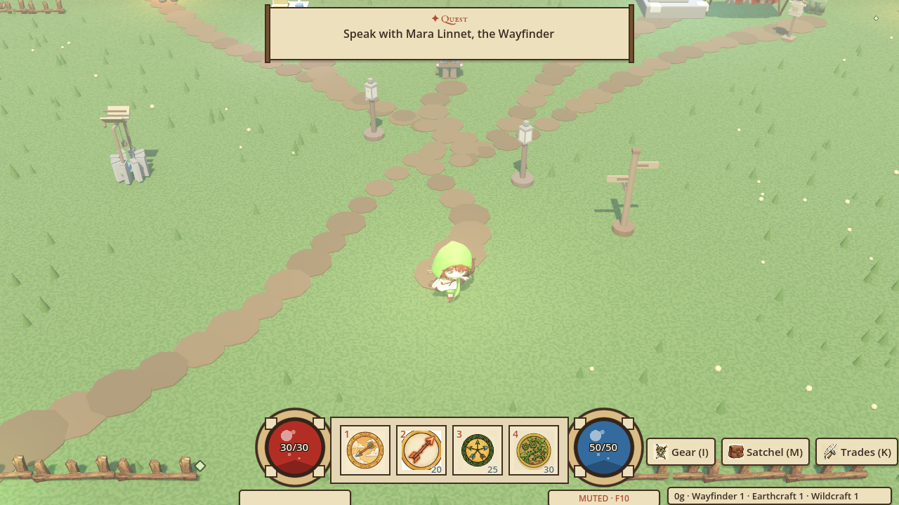
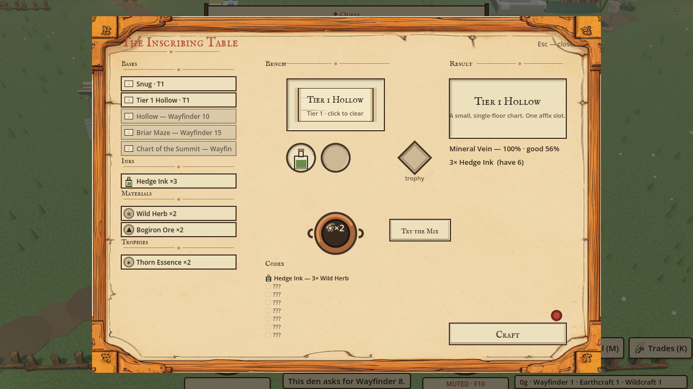
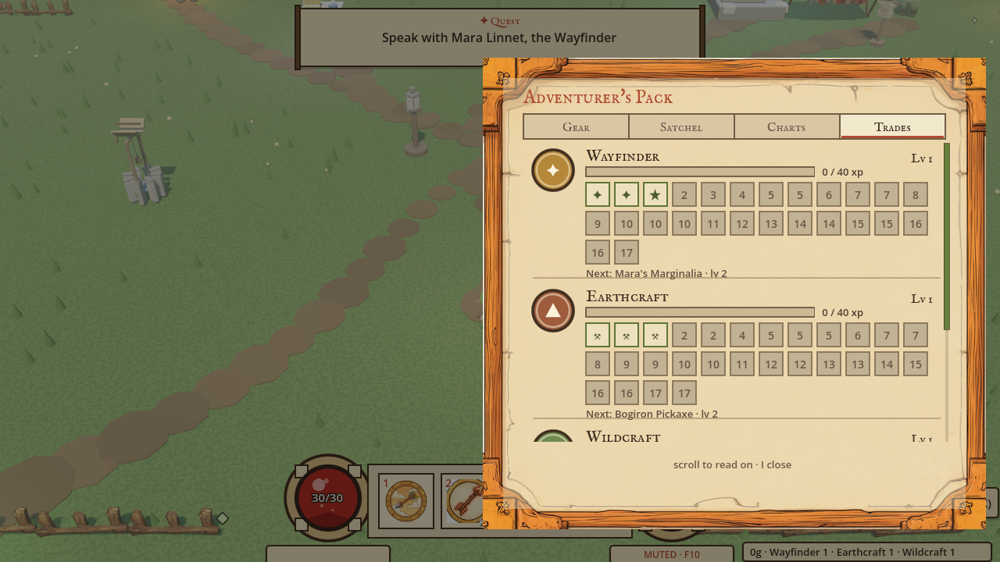
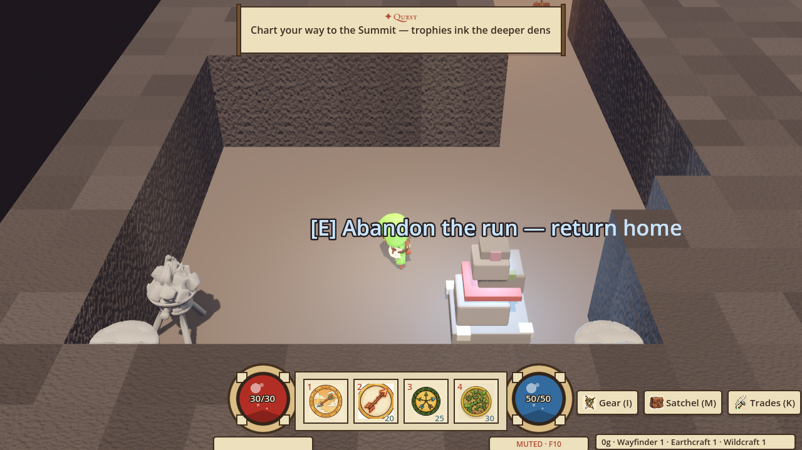
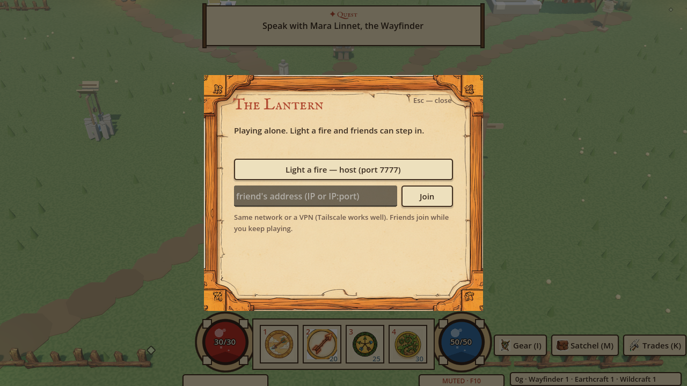

# Wayfinder

A cozy fairytale dungeon-crawler set in **Bramblewood**, built in
**Godot 4.6** — where the heart of the game is a trade called
**Wayfinding**: you forage, mix inks, and inscribe **charts** (dungeon
keys) whose affixes shape every run. Gather → craft → chart → delve,
with friends.



## What's in the game

- **The chart loop** — inscribe charts at a Minecraft-style crafting
  bench (placement sockets, live affix-odds preview, an on-bench mixing
  pot), socket them at the Waystone, and delve procedurally generated
  hollows shaped by the affixes you rolled. 15 rollable affixes, each
  with a good and a bad twin.
- **Recipe discovery** — ink recipes aren't given; you find them by
  experimenting at the pot. Misses smudge (or yield a wild ink, or — 
  rarely — serendipity); NPC riddles point the way; the codex tracks it.
- **Four trades to the level-17 cap** — Wayfinding, Earthcraft,
  Wildcraft, and Huntcraft (kills feed it), each with a full unlock
  ladder: 6 herb tiers, 5 ore tiers, a 24-recipe forge, Quill's buff
  tonics, and perks that change how you play.
- **Combat as one verb** — a 4-slot hotbar picked from 9 skills
  (pierce, thorn nova, hunter's mark, bark-skin ward, execute…),
  per-kind enemy AI, elites with storybook modifiers, and a trophy
  chain of three bosses leading to the Summit.
- **Invite-your-friends co-op** — host a fire, friends join by IP; the
  whole party crosses into the same seed. Host-authoritative enemies,
  per-player loot rolls, kill credit, party-wipe boss rules.

| | |
|---|---|
|  |  |
|  |  |

## Run it

Requires [Godot 4.6](https://godotengine.org/).

```bash
godot --path wyrd
```

**Co-op:** press `Esc` → *The Lantern* → "Light a fire" (host, port
7777). A friend on the same network (or Tailscale) picks Join and types
your IP. Quick local test:

```bash
WYRD_NET=host godot --path wyrd          # window 1
WYRD_NET=join:127.0.0.1 godot --path wyrd  # window 2
```

**Keys:** WASD move · 1–4/F skills · E interact · Q quaff · G grab ·
I pack · M satchel · K trades · Space roll · F10 sound (off by default)

## Tests

Four headless suites gate every change (~350 checks):

```bash
cd wyrd
WYRD_NO_SAVE=1 godot --headless --path . --script res://test_wyrd_loop.gd
WYRD_NO_SAVE=1 godot --headless --path . --script res://test_wyrd_dungeon_scene.gd
WYRD_NO_SAVE=1 godot --headless --path . --script res://test_wyrd_transitions.gd
WYRD_NO_SAVE=1 godot --headless --path . --script res://test_skills.gd
```

## How it's built

The whole game — code, design docs, balance math, tests, and the art
pipeline — is built in collaboration with **Claude** (Anthropic), with
3D models generated through **Meshy**, concept art through
**Midjourney**, and SFX through **ElevenLabs**. The design history
lives in `docs/`: per-feature specs (`docs/specs/`), architecture
decision records (`docs/adr/`), and the world bible.

Co-op networking patterns were informed by studying
[world-of-claudecraft](https://github.com/levy-street/world-of-claudecraft).

## Layout

```
wyrd/        the Godot 4.6 project (scenes, scripts, data tables, tests)
models/      GLB assets (Meshy/Blender pipeline)
docs/        world bible, specs, ADRs, design docs, concept art
```

## Status

A playable demo slice: the full tutorial → chart → trophy chain →
Summit loop works end to end, solo or co-op (town + dungeons). No
license has been chosen yet — all rights reserved for now.
