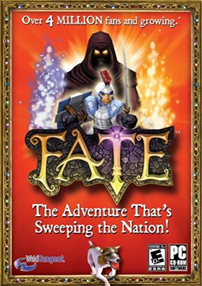
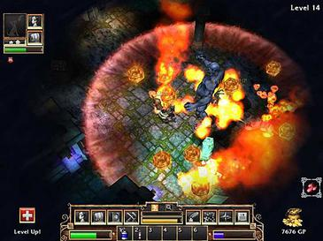
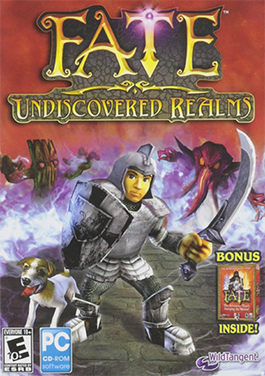

# Fate (2005) — Full Game Breakdown

A comprehensive study of *Fate*, the 2005 action RPG by Travis Baldree at WildTangent. Beloved by everyone who got it preinstalled on a Dell, ancestor of the entire cozy-ARPG lineage (Torchlight → Torchlight II → Rebel Galaxy → arguably modern Hades-likes), and the most underdiscussed gameplay-design template of the 2000s.

> [!note] Why this matters for cozy / RuneScape-flavored projects
> Fate is the best-documented case of "Diablo + Harvest Moon, but the Harvest Moon parts feel emergent, not bolted-on." It's the closest thing to gj26's design lineage in the ARPG branch. Designs from Fate that nobody copied — and probably should — are listed in §10.



---

## 1. The basics

| | |
|---|---|
| **Released** | May 18, 2005 (PC, North America) |
| **Mac OS X** | September 19, 2008 |
| **Remaster (Reawakened)** | March 12, 2025 — Switch, PS5, Windows, Xbox Series |
| **Developer / publisher** | WildTangent |
| **Designer / programmer / art director** | Travis Baldree (his solo project at the time) |
| **Platform reach** | Distributed via WildTangent's pre-installed-on-Dells channel — millions of PCs shipped with the demo |
| **Genre** | Action RPG / dungeon crawler |
| **Direct ancestors** | Diablo (1996), NetHack |
| **Direct descendants** | Torchlight (2009), Torchlight II (2012), arguably the entire cozy-ARPG lineage |
| **Awards** | 2005 *Best RPG* (Computer Games Magazine); finalist for *PC Gamer* awards |
| **Metacritic / GameRankings** | 80% / 80% |

### Travis Baldree, the throughline

Worth noting because it's a quiet legend:

- 2005 — designs/programs/arts Fate solo at WildTangent
- 2009 — co-founds Runic Games, leads Torchlight
- 2012 — leads Torchlight II
- 2014 — leads Rebel Galaxy at Double Damage
- 2022 — *writes* Legends & Lattes, the cozy-fantasy bestseller that arguably *named* the modern cozy genre
- 2024+ — narrates audiobooks (highly regarded in the audiobook community)

The same person who designed the cozy-ARPG template wrote the book that defined cozy fantasy literature. The throughline of his career *is* the cozy genre.

---

## 2. The design pitch (one paragraph)

> A boy or girl walks into the quaint town of **Grove**, picks up a pet (dog or cat), descends through randomly generated dungeon floors fighting monsters and collecting loot, occasionally returns to town to sell, can also fish in pools to feed the pet *fish that transform the pet into stronger creatures*, and eventually retires their character to pass an heirloom to a descendant who plays through again.

That's the entire game. Every mechanic in the rest of this doc serves that pitch. The depth is in how cleanly each system reinforces the others.

---

## 3. The story & lore

A surprising amount of mythology hides under the casual exterior.

### The opening (The Stranger's prologue)

The game opens in Grove with **The Stranger**, a mysterious figure at the inn, who tells the player of:

- A **new evil** descending on Grove
- An **ancient temple** buried deep in the dungeon's catacombs
- Five elemental realms balancing the world

### The five realms

The Stranger names five realms whose balance is held by an ancient tome:

| Realm | Theme |
|---|---|
| **Druantia** | The land of verdant forests |
| **Typhon** | Cities of ice long-since fallen from the clouds |
| **Aquatis** | Murky waters that entomb lost souls |
| **Prometheus** | A world of cracked earth and flaming towers |
| **Khaos** | The realm of eternal turmoil |

Each realm is later visited as a separate dungeon expansion (in *Undiscovered Realms* and *Traitor Soul*).

### The Book of Fate

> *"Hidden within the temple is an ancient tome — The Book of Fate, which maintains the balance between these realms. Within its pages lies the key to Grove's salvation."*

The main quest is to descend into the dungeon, retrieve the Book of Fate, and confront the random end-boss that resides on a level somewhere between floor 40–52.

### The Cursed King's villain — T'Kala

Introduced in *Fate: The Cursed King* (2011):

> *"The evil of T'Kala is described only in whispers. A necromantic priest, power-hungry and cruel, he was executed by the King when his treachery was discovered. The spirit does not speak, but a single thought fills the void... vengeance."*

T'Kala becomes the named antagonist of the Cursed King expansion, in a new town (Ekbatan) with 4 new dungeons.

### Final boss

The original game's final boss is **random** (different each playthrough) and resides on a procgen floor between 40–52. In sequels (Undiscovered Realms, Traitor Soul), the named final boss is **Kaos**, residing in the Temple of Fate.

---

## 4. Core mechanics (full detail)

### 4.1 Character & progression

- **No classes.** You build whatever you want via attribute distribution.
- **Four attributes:** Strength, Dexterity, Vitality, Magic
- **Per level-up:** 5 attribute points + 1 skill point
- **15 total skills** (e.g. Sword Skill, Critical Strike, Charm Magic Skill — each invested independently)
- **No respec** in the base game — investment is committal. The retirement system (§4.7) lets you redirect across generations.

The lack of class is the design's first cozy move. Diablo's class lock-in is genre table stakes; Fate quietly refuses it. Players draft their own role via stat investment.

### 4.2 Skills (15 total)

The game tracks 15 skills. Examples confirmed from documentation:

- **Sword Skill** — proficiency with swords
- **Bow Skill** — proficiency with bows + crossbows
- **Polearm Skill**
- **Staff Skill**
- **Critical Strike** — chance to land double-damage hits
- **Dual Wielding** — reduce penalty for two one-handed weapons
- **Attack Magic Skill** — boost attack-school spells
- **Defense Magic Skill** — boost buff/protection-school spells
- **Charm Magic Skill** — boost mind-control / hostile-conversion spells
- (additional class-specific skills covering shield use, identification, etc.)

### 4.3 Weapons (full taxonomy)

Eight weapon types. Each has a speed and damage class:

| Type | Speed | Damage class | Notes |
|---|---|---|---|
| **Sword** | Slow → Fast | Slashing | Most balanced; widest variety |
| **Axe** | Slow | Crushing | High damage |
| **Club** | Slow | Crushing | Common starter weapon |
| **Bow** | Fast | Piercing | Ranged, dexterity-scaled |
| **Crossbow** | Slow | Piercing | Higher damage, slower |
| **Hammer** | Slowest → Slow | Crushing | Heavy hits, low DPS |
| **Polearm** | Slow | Piercing | Reach |
| **Spear** | Normal | Piercing | Balanced reach |
| **Staff** | Slow | Crushing | Magic boost |

**Dual-wielding** is allowed for one-handed weapons, with stat penalties unless invested in Dual Wielding skill.

### 4.4 Spells (3 categories)

The spellbook holds **up to 6 spells per category**. There are far more than 18 spells available — players choose a loadout.

- **Attack Magic** — direct damage. Examples: *Fireball*, *Frost*, *Lightning Strike*, *Slow*
- **Defense Magic** — buffs, healing, shields, summoning
- **Charm Magic** — mind control: turn enemies into temporary allies

Each magic skill points-invested boosts effectiveness within that category.

### 4.5 The dungeon

- **Procedurally generated** every floor
- **Vertical only — descend, don't return up the same way**
- **Treasure / monster placement randomized** — but tier of content scales with floor depth
- **Limitless** — there's no "final" floor in normal play; floors keep generating
- **Final boss spawn** — between floor 40–52 (random)

Travis described intent as "Diablo accessibility with NetHack permanence" — the dungeon is theoretically infinite, the heroism is in how deep you got before you retired.



### 4.6 The pet system — the famous one

The single most-copied mechanic from this game.

The pet:
- Spawns at start. Player picks **dog (terrier)** or **cat**. Cosmetic choice; mechanically identical.
- **Combat-ready**: attacks autonomously, has its own HP, can be revived
- **Carries inventory**: extra slots beyond yours
- **Can be sent to town to sell** — give it your unwanted loot, it walks back to Grove on its own, sells everything, walks back to your floor. **Time cost, not an interaction.**
- **Levels up** alongside you
- **Equippable** with collars / bands that grant stat bonuses

The "send pet to town to sell" mechanic is the most-copied design from this game. Torchlight, Torchlight II, Rebel Galaxy all use it. Most modern ARPGs wish they had something this elegant. The genius:

1. It removes the *interruption* of inventory management without removing inventory management
2. It rewards you for choosing what to keep (you can't go with the pet — you keep playing)
3. It creates a lovely "alone in the dungeon while my dog runs an errand" beat
4. It scales: pet sells faster as you upgrade speed boosts

### 4.7 Fishing & pet transmutation

The second-most-distinctive system.

- Fishing pools appear in dungeon floors when **fireflies hover over water**
- Buy a fishing rod from **Pikko the Fisherman** (a vendor who appears in dungeons, not just town)
- **Cast → wait for `!` → click on time** — minimal-input fishing minigame
- Catches: Fish (the main draw), gear (occasional), trash items / nothing (some casts fail)

Fish are then **fed to the pet**. Pet transforms based on fish quality:

| Fish tier | Transform duration |
|---|---|
| **Fingerling** | 120 seconds |
| **Small** | 300 seconds (5 minutes) |
| **Lunker** | 600 seconds (10 minutes) |
| **Flawless** | **Permanent** until another fish overrides |

The transformations turn your dog into things like wolves, bears, scorpions, hellhounds, dragons — each with stat profiles that reshape your gameplay. A dog into a Flawless Hellhound is a campaign-altering decision.

Why this is brilliant:
- **Fishing has a non-fishing reason to exist.** RuneScape's fishing rewards XP-toward-fishing; Stardew's fishing rewards money; Fate's fishing rewards *changing your pet's class*. The minigame isn't sealed in a sub-loop.
- **Permanence costs strategy.** Fingerling fish are common but short. Flawless are rare and permanent. You're choosing between often-changing flexibility and locking in a power form.
- **Pet evolution is character development**, not a separate progression. Your relationship with your animal is the longest-arc emotional thread of the game.

### 4.8 Retirement & heirloom system

The final mechanical pillar — and the one that hooks the whole thing into a long game.

When you've finished the main quest, you can **retire** your character. Retirement:
- Awards you a permanent **Fame** stat carry
- Lets you select **one piece of gear** to pass down as an heirloom
- The heirloom **gains stats** with each generation (it auto-improves)
- Your *next* character starts the dungeon over with the heirloom + the Fame bonus

You can retire as many characters as you want. Multi-generational play is encouraged. Your great-great-grandchild plays with an absurdly enhanced sword and cumulative Fame. This is **roguelike-lite meta-progression a decade before Hades made it cool**.

Why this is brilliant:
- **Replayability without repetition.** The dungeon is procgen; the run feels different even with carryover.
- **No "post-credits boredom" cliff.** Most games end after the main quest. Fate's retirement is *its endgame*.
- **Family lineage as story.** Your characters *have descendants*. The world has continuity beyond a single hero.
- **Cozy meta-loop.** No anxiety; just "what shall we try this generation?"

---

## 5. Town of Grove — full NPC roster

The town is small but fully populated. Confirmed NPCs:

### Vendors

| NPC | Role |
|---|---|
| **Dell Arness** | Blacksmith (south end) — buy/sell weapons & armor |
| **Bartleby** | Fat merchant who sells potions |
| **Jin the Seer** | Magic seller (spells, scrolls) |
| **Getts the Traveler** | Sells miscellaneous items; also appears in dungeons |
| **Zim** | Gambler — sells at very high prices |
| **Pikko the Fisherman** | Sells fish and fishing rods (rare encounter; dungeon-roaming) |

### Service NPCs

| NPC | Role |
|---|---|
| **Dreya the Healer** | Across from the fountain — heals you and your pet **for free** |
| **Rikko the Enchanter** | Adds enchantments / sockets to gear for a fee. Cost increases with each retry on the same item. |
| **Banker** | Item storage between dungeon runs |
| **Tavernkeeper** | Quest hub, rumors |
| **Mayor** | Quest-giver |

### Quest NPCs

| NPC | Role |
|---|---|
| **Beregor & Dimo Nor** | Southwest of Gett's Camp at the Dog Kennel — quest-givers |
| **Gimbo Tel** | A neutral *zombie* who wanders the graveyard at the north end of town — quest-giver. (Yes, a friendly zombie. Very Fate.) |
| **Seever, Torvus, etc.** | Random townspeople who give procgen side-quests |
| **The Stranger** | Mysterious figure who delivers the prologue |

### Quest system

- Players can hold **up to 3 active side quests** at a time
- Quests are **procgen** — fetch lost/stolen items from specific dungeon levels, or defeat designated monsters and their minions
- Rewards include gold, gear, and Fame
- Side-quests refresh regularly so the well never runs dry

### Dungeon-roaming vendors (the cozy detail)

Two vendors break the "town vs. dungeon" boundary by appearing inside the dungeon:

- **Pikko the Fisherman** — sells fish and fishing rods on rare encounters
- **Getts the Traveler** — sells miscellaneous goods

The dungeon-roaming vendors are themselves a small design jewel: **the world feels alive when commerce happens outside the safe zone.**

---

## 6. The sequels

Fate spawned three direct sequels and a 2025 remaster. Each adds a layer rather than replacing the prior game.



### Fate: Undiscovered Realms (2008)

The "expansion" sequel. Notable additions:

- **Level cap raised to 199** (from 99 in original)
- **Character import** — bring your retired character forward
- **Two new towns** replacing/supplementing Grove:
  - **Outpost of Druantia** — mossy forests and dry tunnels
  - **Outpost of Typhon** — frozen tundra and arctic wasteland
- **Temple of Fate** — the dungeon hosting Kaos as named final boss
- **Improved mod system** — drop mod folders into a `REALMS/` directory; more stable than the original mod manager; mod count no longer affects loading times

### Fate: The Traitor Soul (2009)

The "consolidation + class system" sequel.

- **Contains all dungeons** from original Fate + Undiscovered Realms + 1 new dungeon
- **Character / class system** — option to start as a non-human race with mechanical differences
- **Level cap removed entirely**
- **Larger pet inventory**
- **Limit Break** — power move on cooldown
- **Real-Time Weapon Change** — swap weapons mid-combat without inventory pause

### Fate: The Cursed King (2011)

The "fully realized" sequel.

- **New town: Ekbatan** with **4 new dungeons**
- **Free rotating camera** — broke the locked-camera limitation of prior games
- **NPC party system** — you can recruit NPC allies, not just a pet
- **Online features** — Facebook integration, item trading, asynchronous social play
- **T'Kala** as named villain (the necromantic priest from §3)

### Fate: Reawakened (March 12, 2025)

Official remaster bundle:
- Includes original Fate + Undiscovered Realms + Traitor Soul + Cursed King
- Released on Switch, PS5, Windows (Steam), Xbox Series X/S
- Modernized textures, controller support, current-gen friendly resolutions
- Critical reception: positive — nostalgia + the still-elegant core mechanics

---

## 7. Reception & cultural footprint

- **Cult favorite, not commercial blockbuster.** WildTangent's distribution model (preinstalled on Dells, demo-then-buy) reached tens of millions but converted modestly.
- **Casual gateway drug** — many people who later played Diablo II / III / Path of Exile / Grim Dawn first played Fate
- **Critical reviews:** ~80% Metacritic. Reviewers loved accessibility, pet, fishing; criticized visual roughness and combat depth.
- **Awards:** *Best Role-Playing Game* of 2005, Computer Games Magazine. Finalist for PC Gamer awards.
- **Steam re-release** (2014) brought it to a new audience.
- **Community:** small but persistent. Wikis, fansites, forum threads still active.
- **Reawakened (2025)** as new entry point for the next generation.

---

## 8. The cozy-ARPG family tree

```
Diablo (1996)            NetHack (1987)
       │                       │
       └────────┬──────────────┘
                ▼
            Fate (2005)  ◄── Travis Baldree
                │
      ┌─────────┼──────────────┐
      ▼         ▼              ▼
 Undiscovered  Traitor      Cursed
 Realms        Soul         King
 (2008)        (2009)       (2011)
                │              │
                └──────┬───────┘
                       ▼
                  Reawakened (2025) — bundle remaster
                       
   Adjacent / parallel:
     - Torchlight (2009)   ◄── Travis Baldree continues
     - Torchlight II (2012) ◄── Travis Baldree
     - Rebel Galaxy (2014)  ◄── Baldree (space ARPG)
     - Diablo III (2012)         — went grimdark
     - Path of Exile (2013)      — went hardcore depth
     - Grim Dawn (2016)          — split the difference
     - Hades (2020)              — meta-progression renaissance
     - Legends & Lattes (2022)   — Baldree's *novel*; named modern cozy literary genre
```

The throughline: **accessible difficulty + emotional pet bond + meta-progression + cozy aesthetic** is now an established sub-genre, and it traces directly back to Fate.

---

## 9. Combat formula (deep mechanics)

Fate's combat resolution is straightforward but worth noting for `game-balance-playbook.md` cross-reference:

- **Damage** = weapon base + str/dex bonuses + skill bonus, modified by armor reduction and elemental resistances
- **Hit chance** = Dex-derived attack rating vs target evasion
- **Crit** = Critical Strike skill % chance to double damage
- **Magic damage** = base spell damage × (1 + Magic Skill / 100) — multiplicative scaling
- **Armor** = subtractive damage reduction (uses subtractive formula like classic OSRS)

This is the **subtractive damage model with skill-multiplicative magic** — see [[game-balance-playbook]] §3 for the broader formula taxonomy. Worth noting that `game-balance-playbook.md` recommends subtractive for cozy/RuneScape-flavored projects — Fate validates that recommendation.

---

## 10. Design lessons (and what the genre forgot)

Things Fate did first or better than its descendants:

### A. Pet-as-merchant
**Copied.** Torchlight, Torchlight II, Rebel Galaxy all retain it. Most ARPGs wish they had it. *Worth copying for any cozy/light-ARPG project.*

### B. Pet transmutation via fishing
**Almost never copied.** Pet customization usually goes through equipment in modern games. The "feed it a fish, it becomes a wolf" mechanic remains genuinely original. *gj26 cottage lookalike: feed an animal a foraged item, it changes appearance/behavior.*

### C. Heirloom retirement system
**Hardly copied.** Hades's Mirror of Night is the closest, but Fate had it 13 years earlier with *generations* not just unlocks. *gj26 application: when you finish a season's main quest, retire to make tea with grandma; child character carries the heirloom into the next season's run.*

### D. Procgen with cozy aesthetic
**Mostly forgotten.** Procgen is now a "roguelike" signal; cozy is now a "hand-crafted" signal. Fate proved you can have both. *gj26 cottage cellar: procgen with a cozy reskin.*

### E. Single-protagonist class-free design
**Inverted.** Modern ARPGs are class-explosion (PoE has 19 ascendancies). Fate's "you build whatever" is genuinely different and feels closer to RuneScape's skill-grind philosophy. *gj26 already does this — multiple parallel skills, no class.*

### F. Fishing as a non-fishing reward path
**Sometimes copied.** Stardew's fishing rewards money; RS's rewards skill XP. Fate's rewards *changes the meta of combat* via pet form. The fishing minigame isn't isolated from the main game — it directly redirects the main game. *gj26 application: fishing rewards aren't just money; they unlock recipes that unlock new NPC dialog. Weave the systems.*

### G. Dungeon-roaming vendors
**Almost never copied.** Most games segregate "safe town" from "dangerous dungeon" cleanly. Fate's traveling merchants make the dungeon feel like a *world*, not a level. *gj26: a wandering tinker NPC who shows up randomly in the goblin field would be peak cozy-RS.*

### H. Time cost ≠ interaction
The pet-to-town selling is the cleanest example. Most modern games make every mechanic *click-required*. Fate said: some mechanics should run in the background while you do the fun thing. *gj26 application: cooking can be a "leave at the pot, walk away, come back" model — not a click-grind.*

### I. Free healer in the hub
Dreya the Healer fully heals you and your pet for free. No HP-management economy in town. Town = safety, full stop. *gj26 already telegraphs this with cottage rest.*

### J. Procgen quests with fixed verbs
Fetch X from floor Y, kill N of monster M. Three or four templates spawn dozens of feeling-different quests. *gj26 daily side hooks (per ONBOARDING.md) should follow this.*

---

## 11. Direct applications to gj26

For your toon-painted RuneScape × Harvest Moon project, the most copy-worthy Fate ideas:

| Fate idea | gj26 form |
|---|---|
| Pet-as-merchant | A trained falcon or pack-cow that walks unwanted gathered logs/fish to the cottage shop overnight |
| Pet transmutation via fishing | Feed your cat a foraged herb → it becomes a different familiar (combat aid, foraging aid, fishing aid) |
| Heirloom retirement | End-of-Year-1 evaluation lets the player "retire" to start Year 1 again with a passed-down item + cumulative reputation in the village |
| Procgen mine floors | Goblin field can be hand-placed; the cottage cellar / mine post-jam can be procgen with cozy aesthetic |
| Dungeon-roaming vendors | A wandering tinker who shows up on random meadow days, cycles inventory weekly |
| Time cost ≠ interaction | Cooking pot, drying rack, brewing barrel — set-and-forget timers that produce items overnight while you do other things |
| Fishing as a meta-redirector | Catch rare fish → take to NPC → unlock a new heart event or trade route |
| Free hub healer | Cottage already heals on sleep; reinforce: no health-economy in the village |
| Procgen quest templates | "Bring N fish to Cynthia" / "Defeat M goblins" / "Gather K herbs" — three templates yield dozens of daily quests |
| Random end-boss | The goblin camp's "boss" rotates between 3-4 named goblin chiefs each playthrough — replayability without rewriting |

The "set-and-forget-then-walk-away" rhythm is the cozy heartbeat that Fate nailed. RuneScape has it (logs respawn while you fish elsewhere). Stardew has it (crops grow overnight). gj26 should ship with it built in, not bolted on.

---

## 12. References

### Primary
- [Wikipedia — Fate (video game)](https://en.wikipedia.org/wiki/Fate_(video_game))
- [Wikipedia — Fate: Undiscovered Realms](https://en.wikipedia.org/wiki/Fate:_Undiscovered_Realms)
- [Travis Baldree — MobyGames](https://www.mobygames.com/person/130074/travis-baldree/)

### Reception
- [GameSpot — Fate Review (2005)](https://www.gamespot.com/reviews/fate-review/1900-6127845/)
- [Metacritic — FATE Reviews](https://www.metacritic.com/game/fate/)
- [TV Tropes — VideoGame/FATE](https://tvtropes.org/pmwiki/pmwiki.php/VideoGame/FATE)
- [PC Gamer — Fate: Reawakened (2025)](https://www.pcgamer.com/games/rpg/fate-reawakened-gives-the-nostalgic-20-year-old-action-rpg-series-a-new-lease-on-life/)
- [TheXboxHub — FATE: Reawakened launch](https://www.thexboxhub.com/revisit-a-classic-fate-reawakened-launches-on-consoles-and-pc/)

### Wikis & guides
- [Fate Wiki on Fandom — Pets, Fishing, Tips, NPCs, Story](https://fate.fandom.com/wiki/)
- [Fate Wiki — Grove (town)](https://fate.fandom.com/wiki/Grove)
- [Fate Wiki — Story](https://fate.fandom.com/wiki/Story)
- [Fate Wiki — Spells](https://fate.fandom.com/wiki/Spells)
- [Fate Wiki — Weapons (list)](https://fate.fandom.com/wiki/Weapons_(list))
- [Fate: The Cursed King Wiki — NPCs](https://fate-the-cursed-king.fandom.com/wiki/NPCs)
- [GameFAQs — FATE Unique Weapon/Armor Guide](https://gamefaqs.gamespot.com/pc/927041-fate/faqs/55425)
- [GameFAQs — FATE Spell Guide](https://gamefaqs.gamespot.com/pc/927041-fate/faqs/49541)
- [GameFAQs — FATE Walkthrough](https://gamefaqs.gamespot.com/pc/927041-fate/faqs/49010)

### Commentary
- [Medium — FATE: The Dungeon Crawler That Started It All](https://medium.com/theuglymonster/fate-the-dungeon-crawler-that-started-it-all-2bf176325e92)
- [Treat Your Geek — Fate vs. Torchlight](https://treatyourgeek.co.uk/fate-vs-torchlight-a-tale-of-two-games/)
- [voidfox.com — Fate in a Nutshell](https://voidfox.com/blog/fate_in_nutshell/)
- [RPGDot — Interview with Travis Baldree](https://rpgdot.rpgwatch.com/localhost/rpgdot.rpgwatch.com/httpdocs/index7e9e.html?hsaction=10053&ID=1135)

### Storefronts
- [Steam — FATE (original) Store Page](https://store.steampowered.com/app/246840/FATE/)
- [GOG — FATE Page](https://www.gog.com/en/game/fate)
- [Steam — FATE: The Traitor Soul](https://store.steampowered.com/app/303680/)
- [WildTangent — FATE](https://www.wildtangent.com/p/action/fate)
- [WildTangent — FATE: The Cursed King](https://www.wildtangent.com/p/action/fate-the-cursed-king)
- [PlayFate.com (Reawakened official)](https://playfate.com/)

## Related in this vault

- [[online-games-2000-2010-survey]] — broader era survey
- [[cozy-life-sim-design-playbook]] — cozy psychology and the time-as-design-material thinking
- [[mmo-game-design-playbook]] — Bartle / progression / endgame theory
- [[game-balance-playbook]] — combat formula reference (Fate uses subtractive damage)
- [[evoke-online-game-feel|evoke-online-game-feel skill]] — the design philosophy this game embodies
