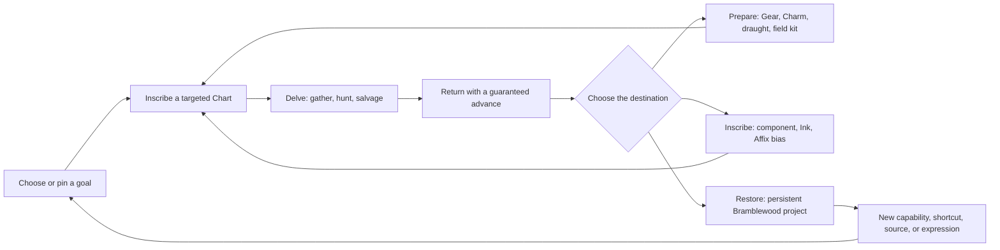
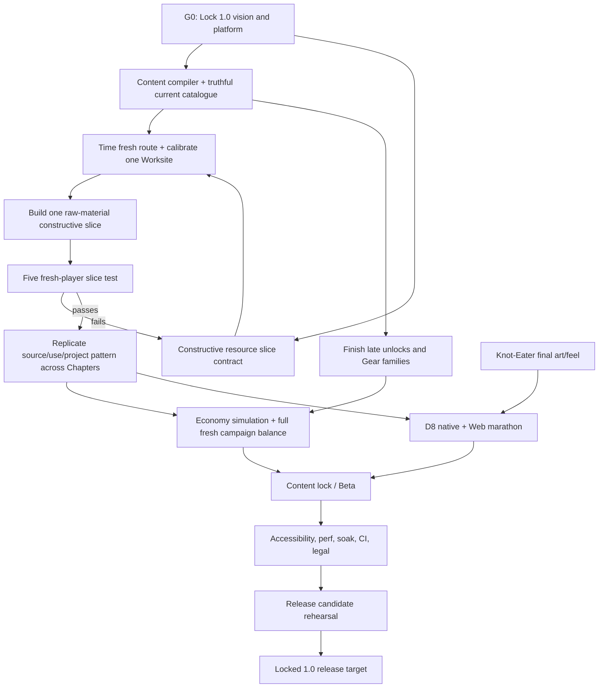

# Wayfinder production completion plan

**Audit date:** 2026-09-02

**Source checkpoint:** `codex/wayfinder-unified` at `e314f2d`

**Game director:** lead Codex agent (product vision, design calls, and final
gate acceptance)

**Chief planner:** Sol Ultra (production sequencing, risk, staffing, and
evidence synthesis)

**Delivery model:** bounded Terra specialist assignments, with independent Terra
QA before the game director accepts a gate

This plan answers a stricter question than “does the game run?” It identifies
what must be true before Wayfinder can be called a production-ready game, what
is already proven, what is only inferred from implementation, what is unknown
until people play it, and how to staff the remaining work without turning one
cozy game into several competing games.

The working planning assumption is a **single-player, Web-first 1.0**. It is
not locked: platform, business model, and target device are explicit G0 human
decisions. Native macOS remains a development and QA target under this
assumption. A signed desktop or storefront release is a separate delivery
track until those decisions are made.

## Executive call

Wayfinder is a **late systems alpha approaching content-complete alpha**. It is
not yet beta and it is not production-ready.

That classification is deliberate:

- The game has a real front door, a playable home, a seeded Hollow runtime, a
  complete campaign state machine, seven Chapter arcs, four level-23 Trades,
  combat, gathering, crafting, Chartmaking, persistence, authored bosses,
  UI, audio, native execution, and a working Web package.
- The implementation reaches the final story and Wayweaver in focused native
  tests. This is much more than a prototype or vertical slice.
- It is not feature/content complete. Some late unlocks are labels or data
  foundations rather than valid player outcomes, two normal recipes have no
  station route, the final boss uses placeholder art, the long D8 browser
  journey is uncertified, and parts of the economy are declared but dormant.
- It is not experience-proven. The prepared first-time-player observation
  sheets contain no participant results. No recorded evidence proves that a
  new player understands the loop, that the full economy avoids grind, that
  the campaign pace holds over hours, or that players want another Delve.
- It lacks a production release system: there is no CI workflow, no locked 1.0
  platform/device matrix, no complete accessibility/localization pass, no
  crash/soak program, and no final legal/licensing checklist.

The production task is therefore not “finish the code.” It is:

> Make the implemented game truthful, make every expedition constructively
> change the player's capabilities or home, prove the complete experience with
> people and telemetry, replace placeholders, and build a repeatable release
> line.

## Evidence rules

Every status statement in this plan uses one of three meanings:

- **Proven** — an executable check was run on the named source checkpoint, or
  a shipped artifact has an exact recorded receipt.
- **Inferred** — code/data exists and appears connected, but the claimed player
  experience or production behavior has not been directly observed.
- **Unknown** — the repository has no current evidence sufficient to answer.

Passing a headless assertion proves its contract. It does not prove fun,
comprehension, pacing, visual quality, comfort, or desire to continue.

## Current production state

### Evidence snapshot

| Area | Evidence | Production call |
|---|---|---|
| Source | Unified local/remote branch at `e314f2d`; `main` is 123 commits behind and is an ancestor | **Proven stable checkpoint** |
| Engine | Project wrapper resolves Godot `4.6.2.stable.official.71f334935` | **Proven** |
| Canonical gate | Fresh 2026-09-02 run: 23/23 entrypoints pass, matching the 1,082-contract manifest | **Proven**, with known shutdown leaks |
| Native startup | Fresh benchmark: 664.1 ms prewarm; 146.1 ms post-click to settled Town, 926 nodes, below the 250 ms gate | **Proven on this Mac only** |
| Web packaging | The unchanged checkpoint has a recorded 118/118 resource audit, 118,023,608-byte PCK, and clean compact `title → town → world → complete` Chrome route | **Proven compact route**; cold-load and final campaign are not proven |
| Core loop | Gather, craft, inscribe, enter, fight/gather, return, award, restore, and save paths exist | **Proven mechanically** |
| Campaign | Prologue plus six Chapters, through Knot-Eater settlement and Wayweaver systems | **Proven in focused native contracts**; full fresh human journey unknown |
| Resources | 89 stackable material records; standard and rootroad ore/herb tiers; logs, Inks, components, trophies, consumables, mastery parts | **Proven data breadth**; source/sink balance unknown |
| Making | 44 station recipes, 10 Ink recipes, 19 Chart recipes, 13 Enchants, bespoke Wayweaver mastery transactions | **Partly proven**; normal and bespoke transaction paths have gaps |
| Gear | 15 base item kinds and 8 named unique definitions | **Playable but thin** relative to the full-game item-family contract |
| Chartmaking | 16 templates, 26 components, 19 recipes, and 24 Chart-affix records; physical grid, Ink rail, preview, and atomic commit | **Strongest production-ready pillar** |
| First-time learning | Instrumentation and observer protocol exist; participant records are blank | **Unknown / blocking** |
| Accessibility | Semantic Controls and visible focus exist on many surfaces; options expose only master volume, mute, and fullscreen | **Incomplete** |
| Final art | Knot-Eater reuses a Barrow Jarl model | **Known blocker** |
| Release operations | Manual scripts exist for gates, export, PCK audit, screenshots, and Web smoke; no repository CI exists | **Manual alpha pipeline** |

### Concrete truth gaps found during this audit

These are not taste opinions. They are content-integrity failures or explicitly
deferred player paths:

1. `wildgold_pickaxe_smith` and `wildgold_axe_smith` produce
   `wildgold_pickaxe` and `wildgold_axe`, but neither item kind exists in
   `wyrd/data/items.gd`. The recipes cannot yield valid normal Gear.
2. Wildgold armor, Wildgold bow, and Dawncap appear in the level ladder as
   visible unlock labels, but repository search finds no corresponding live
   item/material implementation.
3. `wellmoss_salve` and `wellwater_philter` are authored recipes in a secondary
   `ROOTROAD_STILL_RECIPES` list and are not routed through a normal visible
   station catalogue.
4. Chart-entry fees are declared but are not enforced by the live entry path.
   `repair_all` is declared as vendor stock but explicitly hidden because the
   game has no durability mechanic.
5. Full-Pack behavior prevents immediate item loss, but no production policy
   protects a valuable reward across leaving, reloading, or ending a Delve.
6. The ordinary station transaction path and the late Wayweaver mastery path
   are separate frameworks. Adding more making systems before they share a
   resource transaction protocol will multiply edge cases.
7. The 12,617-line `game.gd` owns state, resource transactions, campaign
   settlement, Web automation, and many adapters. It is a parallel-delivery
   bottleneck and a high-conflict file for Terra feature workers.
8. The options surface does not expose remapping, text scale, contrast modes,
   reduced motion, captions, or independent music/SFX control. Gamepad-aware
   code exists, but the UI specification's complete mouse/keyboard/gamepad
   checklist remains unchecked.
9. The fresh canonical run reproduces ObjectDB/resource/RID leaks at shutdown.
   They do not fail the contracts, but they make real memory regressions harder
   to distinguish and must be closed or explicitly baselined before RC.
10. `README.md`, the long roadmap, and older ADR history contain superseded
    claims about Trade count, level cap, bosses, controls, and release state.
    The executable game wins, but a production team cannot safely build from
    contradictory instructions.

## Definition of production-ready

Wayfinder is production-ready only when every gate below is accepted on one
named release candidate. “Mostly green” is not a release state.

### G0 — Product and scope lock

- A concise `DESIGN_VISION.md` names the audience, first-release platform,
  campaign-length target, primary player fantasy, resource/crafting promise,
  visual target, control promise, business model, and explicit exclusions.
- The resource promise resolves the word **constructive**. The recommended call
  is curated Bramblewood restoration and workshop growth, not voxel building.
- The 1.0 content manifest is frozen. New ideas go to post-1.0 unless they close
  a gate.
- All canonical docs agree that the supported product is single-player.

**Measure:** every active epic cites one locked product promise and one 1.0
gate; no “TBD” remains that can change core implementation scope.

### G1 — Content truth and data integrity

- Every visible level-1–23 unlock resolves to a valid, reachable player verb,
  recipe, source, item, station, information feature, or authored story gate.
- Every recipe input/output, Chart cost, drop, vendor ware, reward, icon, model,
  and save field resolves to a known registry entry.
- No production catalogue contains a mechanic the UI intentionally skips.
- No ordinary resource required for progression lacks a renewable source at or
  before its gate.

**Measure:** one headless content compiler reports zero unknown IDs, zero
unreachable recipes, zero source cycles, zero label-only functional unlocks,
zero required placeholder icons, and zero orphaned critical resources.

### G2 — Constructive resource and crafting pillar

The current director recommendation and its human decision gate live in
[`RESOURCE-PILLAR-DIRECTOR-CALL.md`](RESOURCE-PILLAR-DIRECTOR-CALL.md). That
call supersedes broader first-slice machinery proposed elsewhere in this
planning packet.

Every meaningful Delve return must offer three legible destinations:

1. **Prepare** — draught, tool, Charm, Gear, or a bounded field kit.
2. **Inscribe** — Chart component, Ink, Affix bias, or targeted next Road.
3. **Restore** — a visible, persistent Bramblewood project with a practical or
   expressive consequence.

The ordinary grammar is `raw → refined → chosen use`. Longer chains are
reserved for the legendary. The player may pin a wanted result, see its source,
see current/required counts, and know a mercy route. Randomness belongs mainly
in Charts and found Gear; deliberate crafts have previewable outcomes.

**Measure:**

- One complete production slice includes a dungeon source, one refinement,
  one chosen Gear/preparation result, one Chart use, and one three-state town
  restoration project.
- A targeted ordinary Delve always advances one pinned goal.
- At least half of newly added craft outputs are run-shaping, utility,
  restoration, or expression rather than raw damage/defense.
- No required ordinary chain exceeds two transformations.
- No mandatory durability or repair tax is used as the primary sink.
- Four of five fresh slice testers identify source, cost, and payoff without
  external instructions.

### G3 — Economy and progression balance

- A deterministic source/sink graph covers every Chapter and all four Trades.
- Seeded simulations measure material flow, gold, purchases, Pack pressure,
  drop rarity, Chart failure/recovery, and time to each progression gate.
- A complete fresh-save playtest establishes the actual campaign duration and
  removes forced grind spikes. The duration target must be locked from observed
  sessions rather than guessed from recipe counts.
- Buying remains a mercy/convenience route, not the dominant optimal route.
- No buy→craft→sell, salvage→craft→sell, replay-reward, or save/reload
  duplication loop exists.

**Measure:** economy dashboards have agreed target bands; no critical shortage
can exceed one intended ordinary Chart length to recover; all four Trades reach
23 through intended play, not debug grants.

### G4 — Complete campaign and content

- A fresh save can reach the named Unwritten Road, complete the Knot-Eater
  ritual, name the Road, forge/equip Wayweaver, see the epilogue, save, reload,
  and enter an allowed post-campaign Chart.
- Every Chapter has its promised biome identity, resource family, encounter
  composition, keeper, return, restoration, and Neighbor reaction.
- Knot-Eater has final model, materials, animations, telegraphs, VFX, audio,
  collision, Codex image/presentation, and Web packaging.
- No player-facing placeholder, ghost portrait, raw glyph substitute, or
  developer copy remains in the critical path.

**Measure:** two independent native and two independent exported-Web fresh-save
receipts complete the campaign with zero manual state injection, missing
resource, warning, assertion, or exception.

### G5 — Onboarding, comprehension, and desire to continue

- Complete the existing Spec 55 gate first: three native and one Web
  first-time participant, with elapsed times, interventions, exact answers,
  and revision decision recorded.
- Beta then uses at least 12 fresh target-platform participants across the
  declared minimum and typical devices.
- At least 80% complete the first two Charts without intervention; no player
  is hard-blocked for more than three minutes; at least 75% can explain how to
  gather, fight, finish, return, and how Ink changes—not guarantees—a Road.
- At least 60% voluntarily choose or correctly name a desired next action after
  the second return. This is the minimum signal that the loop has pull.

**Measure:** anonymized observation records and telemetry are attached to the
release candidate; every failed threshold produces a named revision and rerun.

### G6 — Combat, dungeon, and feel quality

- Controls, targeting, bow use, gathering interruption, collision, camera
  cutaway, enemy tells, and boss interactions remain readable at supported
  resolutions and frame rates.
- Every boss receives external feel testing; not only scripted state testing.
- Each biome has at least two meaningfully different encounter compositions
  and one resource decision that changes the next preparation choice.
- Death/abandon rules are explained, recoverable, and never delete an
  irreplaceable story resource.

**Measure:** zero P0/P1 feel or readability findings; target-device frame-time
captures meet the locked budget; boss test sheets record tell recognition,
avoidable damage, and recovery clarity.

### G7 — Accessibility and input

- All required actions work with mouse/keyboard and the declared controller
  set; controls can be rebound or the product explicitly narrows its supported
  input promise before release.
- Text scaling, non-color status communication, reduced motion/camera shake,
  captions for meaningful audio, and high-contrast focus are available.
- All critical UI remains usable at 1280×720 and the declared ultrawide/high-DPI
  matrix.
- Player-facing strings are externalized or at least routed through one
  localization-safe interface before the script-embedded text surface grows.

**Measure:** automated focus/input traversal plus manual accessibility passes;
no critical instruction depends on color, sound, tiny captions, or one input
device.

### G8 — Stability, saves, and architecture

- Save migration fixtures cover every publicly shipped version still promised
  compatible; corrupt-primary recovery and campaign escrow recovery stay green.
- The active-Delve close/reload policy is explicit in UI and tested.
- Resource transactions share one normalized ledger/protocol across stations,
  Charts, vendors, drops, campaign rewards, restoration, and Mastery.
- The public `Game` API remains stable while high-change resource and run
  settlement logic moves behind owned modules. This is an integration-enabling
  change, not a general rewrite.
- Shutdown leaks are eliminated or a measured, documented engine-only baseline
  proves they do not grow during repeated Town/World cycles.

**Measure:** 100 repeated Town↔World transitions and a two-hour target-device
soak have zero crash, soft-lock, duplicate reward, lost save, or unbounded
memory growth.

### G9 — Performance and Web delivery

- Keep the existing hard raw budgets at minimum: PCK ≤128 MiB, gzip WASM
  ≤10 MiB, first navigation ≤150 MiB, individual source GLB ≤16 MiB.
- Establish a declared minimum Web device/network and measure cold title,
  title→Town, first Chart entry, and repeated transition time. The recommended
  initial user-facing targets are P75 load-to-title ≤15 seconds and P95 ≤30
  seconds; the owner may revise them only in G0 with device/network evidence.
- Shader warmup, asset LOD/import limits, caching/versioning, and loading/error
  presentation are verified on a cold cache.
- The long D8 browser marathon passes independently of the compact smoke route.

**Measure:** a versioned performance report from the exact RC artifact, not a
development import cache or an older `wyrd/build/` directory.

### G10 — QA, release operations, legal, and support

- CI runs script compilation, canonical 23-entrypoint gate, content compiler,
  save migrations, export/PCK audit, and browser smoke on every release change.
- All retained `test_*.gd` entrypoints are classified as gate, fixture,
  long-driver, or quarantined-with-owner. There are no unnamed “historical
  failures.”
- RC has zero open P0/P1 issues; every P2 has an owner and explicit waiver or
  fix target.
- Build/export/deployment are reproducible from a clean checkout and produce a
  fingerprinted artifact.
- Asset provenance and current tool licenses are rechecked; the game license,
  privacy statement, feedback behavior, credits, versioning, backup/rollback,
  release notes, and support contact are finalized.

**Measure:** one clean-machine RC rehearsal builds, tests, deploys to staging,
passes smoke, rolls back, and restores the same save without manual file edits.

## Resource and crafting: the core production program

The detailed implementation audit is in
[`../research/current-resource-crafting-audit.md`](../research/current-resource-crafting-audit.md).
The comparative design recommendation is in
[`../research/crafting-systems-comparative-research.md`](../research/crafting-systems-comparative-research.md).
The narrowed game-director recommendation is in
[`RESOURCE-PILLAR-DIRECTOR-CALL.md`](RESOURCE-PILLAR-DIRECTOR-CALL.md).

### The product call

Wayfinder should borrow the **constructive consequence** of Minecraft,
Terraria, Valheim, Stardew Valley, and Monster Hunter without importing a
second survival-building game.

The right promise is:

> What I bring back from a Hollow lets me prepare deliberately, author a more
> useful next Road, and make Bramblewood visibly more capable and more mine.

Use authored contribution sites with damaged, working, and tended states. Let
the player choose an equal-power finish, planting, banner, light, or tool
arrangement. Projects may unlock a shortcut, source hint, loadout convenience,
station tier, or story presence. Do not add arbitrary voxel placement,
structural physics, raids, upkeep, or dozens of micro-stations.

### Resource architecture to standardize

Every important material family needs:

- one primary skillful source;
- one slower mercy source;
- one short refinement path;
- at least two meaningful destinations, with important families reaching all
  three destination lanes;
- a source card and pinned-goal forecast;
- a protected role if it is a Seal, trophy, Rune, or campaign witness; and
- an explicit sink ceiling so a finite project stays finished.

### Resource P0 — make current content truthful

1. Add valid Wildgold master-tool item records and art, or remove the recipes
   and unlock promises until they are real.
2. Implement or deliberately cut Wildgold armor/bow and Dawncap from 1.0; no
   level may advertise an absent functional reward.
3. Route the Rootroad Still recipes through a visible restored station and
   prove their use, or remove them from production data.
4. Remove dormant repair and entry-fee declarations unless the chosen economy
   uses them. The recommended design rejects mandatory durability repair and
   prefers positive sinks.
5. Add a content compiler before adding any new resource IDs.

### Resource P1 — prove one constructive slice

Use existing First Knot or Golden Wallow content. Do not build seven Chapters
in parallel before this slice is fun.

- Time one fresh route through First Knot and the first Earthcraft lesson
  before locking the Worksite cost.
- Add one raw-material-only Earthcraft + Wildcraft Worksite with a damaged
  projection, one atomic contribution, one modest benefit, one Neighbor beat,
  and one equal-power finish choice.
- Show exact current/required counts and one plain source line locally at the
  Worksite. Do not begin with a global pin, HUD route finder, salvage currency,
  return chest, generalized pity, or Resource Ledger extraction.
- Run the five-person comprehension gate and revise once before replication.

### Resource P2 — scale across the campaign

- Build a source/sink matrix by Chapter and Trade.
- Ensure each Chapter introduces at most one main new resource family, one
  transformation, and one visible project tier.
- Collapse redundant materials before adding missing ones. Breadth is not
  depth.
- Give crafted Gear chosen identities; do not let many named recipes collapse
  invisibly onto the same generic leather/bow base unless that sameness is
  presented deliberately.
- Choose and test a persistent full-Pack valuable-reward policy as its own
  release-quality task; do not couple pickup ownership to the first Worksite or
  assume salvage is the answer.
- Add deterministic salvage, limited rollback/re-inking, and wishlists only
  after the first slice proves their value.
- Keep field crafting narrow: emergency recovery or one-use preparation, while
  durable making remains a homecoming ritual.

### Resource P3 — tune and certify

- Emit development-only transaction telemetry from one shared Resource Ledger.
- Simulate fixed seeds and player strategies from new game through all four
  level-23 caps.
- Playtest normal, unlucky, overspending, full-Pack, death, abandon, and
  corrupted-save recovery routes.
- Tune source density, yield, recipe cost, gold, and pity from observed data.
- Freeze the 1.0 catalogue and produce the final source/use Codex copy and art.

## Whole-game workstreams

| Workstream | Current state | Missing before production | Blocks |
|---|---|---|---|
| Product direction | Strong ADRs, glossary, world/UI bibles, full-game spec; no concise design vision | Lock target player, platform, campaign duration, constructive promise, commercial scope, 1.0 exclusions | All expansion |
| Resource/crafting economy | Broad working foundation; Chartmaking is strong | Truth fixes, shared ledger, pinned goals, restoration choice, salvage, source graph, sim, human proof | Content scale, balance |
| Progression/content | Four 1–23 ladders and full campaign contracts | Remove label-only unlocks, complete Gear families and sources, validate all entries, freeze manifest | Beta |
| Campaign/narrative | Seven arcs and final settlement code exist | Full fresh-save receipts, epilogue/endgame validation, final copy/readability pass | Content lock |
| Dungeon/encounters | Seeded room grammar, roles, affixes, bosses, readability gates | Full biome/encounter variety audit, resource-targeting experience, boss human feel tests, D8 marathon | Beta |
| Art/animation/VFX | Coherent low-poly direction, many production assets, shared player rig | Knot-Eater final asset, remaining critical portraits/icons/attachments, boss/Trade actions, VFX consistency | Content lock |
| Audio | Town theme and roughly 26 gameplay SFX | Dungeon/biome/boss music plan, missing craft/impact/ambient cues, captions and mix pass | Polish/accessibility |
| UI/onboarding | Unified theme, semantic Controls, strong Chart Table, guided first Road | Fresh-player study, source/use visibility, wishlist/project UI, input/accessibility options, string routing | Beta |
| Architecture | Strong tests and pure data seams; `Game` remains integration hub | Resource ledger/protocol, content compiler, lower collision surfaces for parallel agents, leak cleanup | Safe feature delivery |
| Performance/Web | Export, audit, compact Chrome smoke, startup benchmark | D8 Web route, cold-cache targets, PCK reduction, target-device matrix, caching/LOD report | RC |
| QA/release | Excellent manual and headless tools | CI, complete test classification, soak/crash matrix, reproducible deployment/rollback | RC |
| Legal/support | Credits and attribution ADR exist | License choice, current generator terms review, privacy/support policy, release checklist | Public 1.0 |

## Dependency graph and critical path

The **critical path** is G0 → content truth → one measured constructive slice →
human validation → campaign replication → economy balance → full fresh D8
route → beta hardening → RC. A shared transaction extraction is evidence-led
hardening, not a prerequisite for proving the Worksite. Final boss art can run
in parallel but must land before D8 certification. General polish that does
not close one of these nodes is not critical-path work.

## Sequencing in horizons

### Horizon 0 — lock and make truthful

- Sol Ultra writes and gets owner approval on the 1.0 vision, constructive
  promise, platform/device matrix, and cut list.
- Terra architecture/content-integrity pair closes invalid outputs, unreachable
  recipes, label-only unlocks, dormant catalogue entries, and test taxonomy.
- Establish CI for the existing canonical gate before expanding the catalogue.

**Exit:** G0 accepted; content compiler green; current game makes no false
promise; branch remains releasable.

### Horizon 1 — prove constructive delving

- Resource/economy Terra defines the source/use/project matrix and first slice.
- Restoration Terra implements one authored contribution site.
- UX Terra implements only local need/source/payoff presentation.
- Independent QA Terra tests atomicity, save/load, double-spend, and projection
  invariants; the playtest producer runs five fresh participants.

**Exit:** G2 slice accepted by automation and people. If the player does not
feel “I brought something home and made the place more capable,” iterate here.

### Horizon 2 — complete and replicate content

- Replicate the accepted material grammar through each Chapter.
- Complete Wildgold/Dawncap decisions, Gear identities, reachable late recipes,
  icons, attachments, project states, and Neighbor reactions.
- Finish Knot-Eater art, animation, VFX, audio, and external boss testing.
- Do not add a new general-purpose system unless the accepted slice cannot
  express a required Chapter payoff.

**Exit:** G1 and G4 content-complete; no placeholders; content manifest frozen.

### Horizon 3 — balance the whole game

- Run deterministic economy simulations and full fresh-save playthroughs.
- Tune yields, recipes, gold, drops, XP, boss pacing, pity, and recovery.
- Complete the Spec 55 first-time gate and broader beta onboarding sample.
- Certify native and Web D8 from the title through Wayweaver and epilogue.

**Exit:** G3, G5, and G6 accepted; beta candidate declared.

### Horizon 4 — production hardening

- Finish input/accessibility/localization safety.
- Profile cold Web delivery and reduce PCK/import cost against target devices.
- Eliminate or baseline leaks; run repeated-transition and two-hour soak tests.
- Complete CI, clean-checkout build, staging deploy, rollback, licenses, privacy,
  support, credits, and release documentation.

**Exit:** G7–G10 accepted on one fingerprinted RC.

### Horizon 5 — release and observe

- Deploy the exact RC to a versioned staging URL, then promote the immutable
  artifact to stable `/play/`.
- Preserve prior stable release for rollback.
- Watch opt-in funnel/performance/error data and incoming feedback; hotfix only
  crashes, blockers, save risks, or severe accessibility defects during the
  stabilization window.

**Exit:** 1.0 stable, rollback unused or rehearsed successfully, no open P0/P1.

## Specialist Terra staffing map

The lead Codex agent is the game director and owns product coherence, design
approval, cross-feature tradeoffs, and final gate acceptance. Sol Ultra is the
chief production planner: it owns sequencing, staffing proposals, risk, and the
evidence needed for each call. Neither should become the default feature
implementer.

Use at most **two Terra builders plus one independent Terra reviewer** at once.
The repository is shared, and `game.gd`, `town.gd`, `layout_loader.gd`, and the
large UI controllers are collision hotspots. Every assignment must declare file
ownership and an integration API before editing.

### 1. Terra — Product/content integrity engineer

**Charter:** make authored promises mechanically truthful and create a fail-
closed content compiler.

**Inputs:** `CONTEXT.md`, progression/items/gather/crafting/charts/economy data,
Spec 56, save fixtures, current audit.

**Outputs:** registry validator, unknown-ID/source/reachability report, fixed or
cut late unlocks, classified test matrix, CI-friendly command.

**Acceptance:** zero invalid recipe outputs; zero label-only functional unlocks;
every required material has a source and consumer; every player-facing asset
has an approved final/fallback policy; canonical gate stays green.

**Primary ownership:** data validators and focused tests. Coordinate all edits
to `game.gd` through the architecture agent.

### 2. Terra — Resource economy designer/engineer

**Charter:** own the complete dungeon-resource economy and make it constructive,
targetable, finite, and measurable.

**Inputs:** comparative crafting research, resource implementation audit,
content compiler output, campaign ladder, Chapter duration targets.

**Outputs:** source/sink matrix, resource categories, recipe/refinement grammar,
pity/mercy rules, salvage lane, gold policy, transaction telemetry, seeded
economy simulator, tuned data.

**Acceptance:** one targeted ordinary Delve advances the pinned goal; no
arbitrage/duplication/dead resource; no critical recovery exceeds one ordinary
Chart; all four Trades reach 23 through simulated intended activity; observed
play stays within accepted shortage/stock bands.

**Primary ownership:** new resource/economy modules and data. Does not design
new world geometry.

### 3. Terra — Resource architecture/integration engineer

**Charter:** make parallel delivery safe without rewriting the game.

**Inputs:** current public `Game` APIs, save schema, ordinary crafting path,
Chart commits, mastery path, vendor/drop/reward transactions.

**Outputs:** Resource Ledger/transaction protocol behind existing methods,
normalized receipts, known-ID validation, stable adapters, integration tests,
leak investigation.

**Acceptance:** every add/spend/convert/reward action emits one normalized
receipt; failed transactions are atomic; existing saves and all gates remain
green; feature Terras no longer need unrelated edits inside `game.gd` for new
recipe/project content.

**Primary ownership:** `game.gd` integration seam and new services. Sole editor
of that seam during its sprint.

### 4. Terra — Restoration and world-construction designer

**Charter:** deliver the constructive feeling through authored Bramblewood
projects rather than a freeform building game.

**Inputs:** locked constructive promise, world bible, Town layout clearances,
campaign restorations, resource matrix, art bible/pipeline.

**Outputs:** project-site schema, damaged/working/tended states, one functional
benefit, one equal-power visual choice, save projection, Neighbor reaction,
replication kit for later Chapters.

**Acceptance:** the first site changes visibly and persists; both finish choices
are equally functional and survive save/load; the project cannot consume twice;
four of five new players can point to what their materials changed.

**Primary ownership:** new project module/scenes and bounded Town hooks, not
global Town rearrangement.

### 5. Terra — Crafting UX and accessibility designer/engineer

**Charter:** make “where does this come from, what can it become, and what
should I do next?” answerable in-game for every important material.

**Inputs:** UI Bible, semantic component library, source/sink matrix, onboarding
storyboard, target input/accessibility matrix.

**Outputs:** pin/wishlist, source cards, missing-input display, use lookup,
project contribution UI, full-Pack recovery UX, options/accessibility additions,
keyboard/controller traversal tests.

**Acceptance:** all critical crafting routes work without a wiki; supported
inputs reach every action; no critical state relies only on hue/sound; target
font/viewport matrix passes; first-time comprehension thresholds pass.

**Primary ownership:** UI components and focused adapters. It consumes
read-only domain views rather than owning transactions.

### 6. Terra — Dungeon and encounter content designer

**Charter:** make Delves the intentional primary source of materials and
choices, while keeping combat one verb among many.

**Inputs:** Chart/Affix system, room grammar, Chapter resource matrix, enemy
roles, duration budgets, performance budgets.

**Outputs:** Chapter encounter/resource budgets, targetable source rooms,
distinct compositions/hazards, keeper tuning, full-Pack-safe rewards, D8 route
support.

**Acceptance:** every Chapter's required source appears before use; Affix
previews have visible world evidence; target farming changes expected yield
without hard-locking layout; every boss tell is recognized in human testing;
5–10 minute early and ≤25 minute mature Chart promises hold.

**Primary ownership:** dungeon/encounter data and modular encounter scripts;
coordinate shared loader edits through one integration window.

### 7. Terra — Progression, telemetry, and balance analyst

**Charter:** turn correct formulas into a paced full game.

**Inputs:** simulator ledger, Trade XP curve, Chart durations, loot tables,
resource costs, external playtest logs.

**Outputs:** balance workbook/report, target bands, simulated player strategies,
fresh-save timing analysis, tuned constants/data, regression scenarios.

**Acceptance:** intended and unlucky routes remain recoverable; no Chapter asks
for unrelated grind; gear choices remain meaningful; difficulty bands predict
observed fights; campaign duration and Trade-23 timings meet the locked vision.

**Primary ownership:** analysis artifacts, simulations, and data tuning after
content lock—never simultaneous blind tuning with content authors.

### 8. Terra — Narrative and onboarding designer

**Charter:** connect each resource transformation and restoration to a Neighbor,
place, and clear next intention in Bramblewood's voice.

**Inputs:** World Bible, campaign state, onboarding storyboard, project sites,
source/use UI, playtest confusion logs.

**Outputs:** concise station/project lessons, Chapter reactions, source hints,
epilogue, recovery copy, localization-ready string inventory.

**Acceptance:** no critical recipe or source depends on lore inference; text
fits the UI/read-time budget; Ink-as-bias is understood; final resolution reads
as renewal, not extermination; copy has no developer/domain leakage.

**Primary ownership:** content tables/string resources and bounded presentation
adapters, not progression authority.

### 9. Terra — Character/boss art and animation specialist

**Charter:** finish Knot-Eater and any other critical character/keeper
presentation against the shared asset pipeline.

**Inputs:** concept lock, humanoid/creature pipeline, encounter telegraph timing,
Codex needs, Web size budget.

**Outputs:** final cleaned GLB(s), materials/textures, animation clips, collision
and attachment markers, renders, delivery receipt, import and PCK validation.

**Acceptance:** unique silhouette at the FATE camera; every phase reads before
damage; no placeholder/fallback path; native Forward+ and Web Compatibility
match intent; asset stays within agreed PCK/GLB budgets.

**Primary ownership:** Blender sources, production model/texture/animation
assets, and isolated presentation adapters.

### 10. Terra — Environment/technical art specialist

**Charter:** finish project sites, biome identity, lighting, LOD/import settings,
collision, and Web-friendly asset delivery.

**Inputs:** Art/UI/World bibles, accepted restoration designs, biome budgets,
current export manifest and screenshots.

**Outputs:** modular environment assets, project states, final icons/portraits
with the UI art agent, LOD/import pass, package-size report, before/after renders.

**Acceptance:** each Chapter reads at play distance; no obstruction or
navigation regression; no missing texture in PCK; target frame time and package
budgets pass; authoring provenance is recorded.

**Primary ownership:** environment assets/import metadata and bounded scene
composition changes.

### 11. Terra — Combat feel, VFX, and audio specialist

**Charter:** make gathering, refining, crafting, hits, bosses, restorations, and
Wayweaver feel materially different through restrained feedback.

**Inputs:** encounter timings, animation events, audio inventory, reduced-motion
requirements, World/UI voice.

**Outputs:** feedback event map, missing SFX/music/ambience, mix categories,
captions, VFX, hitstop/camera-shake accessibility variants, capture evidence.

**Acceptance:** actions are distinguishable without looking at text; critical
signals have visual/caption alternatives; mix has no clipping or masked tells;
reduced-motion mode remains readable; five-minute combat and crafting sessions
produce no fatigue/blocker finding.

**Primary ownership:** effect/audio assets and small event consumers, not core
combat authority.

### 12. Terra — QA and release engineer

**Charter:** own evidence, not features.

**Inputs:** all gate definitions, test manifest, Web smoke tools, export preset,
save fixtures, target device/browser matrix.

**Outputs:** CI, test classification, D8 browser marathon, content/PCK audits,
performance and soak runners, RC checklist, artifact fingerprint, staging and
rollback rehearsal.

**Acceptance:** clean checkout reproduces the artifact; all mandatory gates are
green; no unowned quarantine; two independent D8 Web passes; exact RC deploy
and rollback succeed; final report distinguishes warnings from waivers.

**Primary ownership:** test/release tooling, CI, manifests, and evidence. This
agent does not self-approve a feature it implemented.

### 13. Terra — Playtest producer/research synthesizer

**Charter:** create the human evidence automation cannot supply.

**Inputs:** observer protocol, public/staging URLs, telemetry schema, target
audience/device criteria.

**Outputs:** participant briefs, privacy-safe session records, confusion clips
or notes, comprehension/timing summary, prioritized findings, rerun decision.

**Acceptance:** participant criteria are met; observers do not teach; exact
questions and interventions are recorded; thresholds are computed; every P0/P1
finding has an owner and is retested.

**Primary ownership:** playtest artifacts and synthesis. Human participants
remain real people; an agent may organize or analyze but may not impersonate
fresh-player evidence.

## Sol/Terra operating cadence

For each production slice:

1. **The game director frames and approves the player promise** — what the
   slice must feel like, what is in/out, and what would make it unworthy of the
   game.
2. **Sol Ultra plans the delivery** — dependencies, staffing, file ownership,
   measurable gates, risks, and kill criteria.
3. **One Terra implements** within the charter. A second Terra may work only on
   a non-overlapping artifact or asset lane.
4. **Independent Terra QA attacks the result** against the gate and adds a
   reproducible failing case for each real defect.
5. **The game director adjudicates** design tradeoffs and accepts or rejects
   the slice; Sol updates the critical path and prevents unrelated work from
   entering scope.
6. **A human gate runs where required.** No agent substitutes its judgment for
   first-time comprehension or fun.

Each charter must end with a commit, exact test receipt, changed-file list,
remaining risks, and an explicit “safe for next agent” integration note.

## Risk register

| Risk | Likelihood | Impact | Trigger / evidence | Mitigation | Owner |
|---|---|---|---|---|---|
| Green-test illusion | High | Critical | 23/23 passes despite invalid Wildgold outputs and absent human evidence | Content compiler + player gates; never promote assertion count to “finished” | Sol + QA |
| Crafting scope becomes a second game | High | Critical | Requests drift toward Minecraft-scale construction | Lock authored restoration promise and explicit exclusions in G0 | Sol |
| Resource breadth creates grind, not agency | High | Critical | 89 materials without full source/sink/time simulation | Collapse redundant IDs; source/use matrix; simulator; wishlist and pity | Economy Terra |
| Central integration bottleneck | High | High | `game.gd` is 12,617 lines and common to many features | One integration owner; stable APIs; extract Resource Ledger behind façade | Architecture Terra |
| Parallel agent collisions | High | High | Multiple Terras edit `game.gd`, `town.gd`, or `layout_loader.gd` | File ownership, two-builder cap, integration windows, QA on merged state | Sol |
| Full campaign is technically correct but not playable | High | Critical | No fresh title→Wayweaver human or Web receipt | Full fresh campaign runs, D8 marathon, staged beta sessions | QA + playtest |
| Final boss fails identity/readability | Certain until fixed | High | Knot-Eater uses Barrow Jarl placeholder | Dedicated art/animation/feel lane before D8 certification | Character Terra |
| Web package/load loses players | Medium-high | High | 118 MB PCK, no current target-network cold-load report | Size/import/LOD pass, cold-cache budgets, versioned caching | Tech art + QA |
| Economy inflation or soft-lock | High | High | Narrow sinks; dormant fees/repair; no full route sim | Positive sinks, recovery ceiling, source graph, multi-strategy sim | Economy Terra |
| Valuable full-Pack reward is abandoned | Medium | High | No persistent overflow/recovery path | Lock and test one-shot reward recovery policy | Economy + UX |
| Save migration breaks a public profile | Medium | Critical | Large campaign/resource schema and public 0.1.x saves | Immutable fixtures, atomic backup, clean upgrade/downgrade rehearsal | Architecture + QA |
| Accessibility discovered after UI/content lock | High | High | Options are minimal; strings embedded; input checklist open | Begin accessibility/string routing in Horizon 1, certify in Horizon 4 | UX Terra |
| Asset/license provenance blocks release | Medium | High | Generative assets, incomplete historical receipts, no chosen game license | Current-terms audit, attribution manifest, explicit license before RC | Release Terra |
| Shutdown warnings hide a real leak | Medium | High | Fresh tests reproduce ObjectDB/RID/resource warnings | Leak inventory, repeated-transition memory baseline, fail on growth | Architecture + QA |
| Documentation sends agents toward stale product | High | Medium | README/roadmap/older ADR claims conflict with 1.0 state | Reconcile active docs after G0; mark historical docs unmistakably | Sol |
| Polish churn delays the critical path | High | Medium | Many checkpoint passes optimize isolated screens/rooms | Every task must close a production gate or be deferred | Sol |

## Go/no-go scorecard

Sol should publish a single scorecard for every candidate:

| Gate | Alpha exit | Beta exit | RC exit |
|---|---|---|---|
| Product/scope | G0 locked | No 1.0 feature additions | Only P0/P1 fixes |
| Content truth | Compiler green on current catalogue | Final manifest frozen | Exact artifact audit green |
| Constructive pillar | One human-accepted slice | Pattern spans all Chapters | Economy data frozen |
| Campaign | Focused native contracts | Fresh native completion | 2 native + 2 Web RC completions |
| Human onboarding | Existing 4-person gate complete | 12-person thresholds met | No known hard block |
| Art/content | Placeholder list owned | Zero critical placeholders | PCK contains all finals |
| Stability | Canonical 23 green | Full classified matrix + soak | Zero P0/P1; save rehearsal green |
| Accessibility/input | Scope and matrix locked | Features implemented | Manual/automated certification |
| Performance/Web | Budgets and devices locked | D8 staging pass; budget green | Cold-cache RC report green |
| Release/legal | CI skeleton | Staging/repro build | Deploy/rollback/licenses/support ready |

## Immediate next assignments

Do these in order:

1. **Game director + Sol Ultra:** frame G0; the human owner approves the
   constructive restoration call, platform, audience, and release scope.
2. **Product/content integrity Terra:** build the availability manifest/content
   compiler and resolve
   Wildgold, Dawncap, Rootroad Still, repair/fee, and label-only truth gaps.
3. **Resource economy Terra:** time the fresh First Knot/Earthcraft route and
   calibrate a raw-material Lantern Walk cost.
4. **Restoration Terra + crafting UX Terra:** build one bounded Worksite with
   local need/source clarity; do not pre-build generalized pin, salvage, pity,
   overflow, or ledger systems.
5. **Independent QA Terra + playtest producer:** attack the atomic save/world
   projection and run the five-person acceptance.
6. **Only after that pass:** replicate to later Chapters while character art
   finishes Knot-Eater in parallel.
7. **QA/release Terra:** build D8 Web certification, CI, performance, and soak
   infrastructure throughout; do not wait until content lock.

The first hiring need is therefore **not another general game programmer**. It
is a resource/economy systems specialist paired with a content-integrity/
integration specialist, followed by a crafting UX/restoration specialist and
independent QA. Final-boss art and Web/release engineering are parallel
specialties with clear, later gates.

## Evidence sources

- [`../../CLAUDE.md`](../../CLAUDE.md) — canonical repository instructions
- [`../../CONTEXT.md`](../../CONTEXT.md) — single-domain language
- [`../PROJECT-OUTLINE.md`](../PROJECT-OUTLINE.md) — reconciled project map
- [`../wyrd-roadmap.md`](../wyrd-roadmap.md) — implementation history/state
- [`../test-manifest.md`](../test-manifest.md) — canonical and Web receipts
- [`../specs/56-full-game-arpg-saga.md`](../specs/56-full-game-arpg-saga.md) —
  full-game content contract
- [`../specs/57-first-session-onboarding-storyboard.md`](../specs/57-first-session-onboarding-storyboard.md)
- [`../specs/58-wayfinding-chart-table.md`](../specs/58-wayfinding-chart-table.md)
- [`../playtests/55-completion-audit.md`](../playtests/55-completion-audit.md)
- [`../playtests/55-first-chapter-observation.md`](../playtests/55-first-chapter-observation.md)
- [`../research/current-resource-crafting-audit.md`](../research/current-resource-crafting-audit.md)
- [`../research/crafting-systems-comparative-research.md`](../research/crafting-systems-comparative-research.md)
- [`RESOURCE-PILLAR-DIRECTOR-CALL.md`](RESOURCE-PILLAR-DIRECTOR-CALL.md) —
  authoritative narrowed recommendation and open human gate
- ADRs 0003, 0013, 0016, 0017, and 0018
- Fresh 2026-09-02 Godot 4.6.2 canonical-gate and startup benchmark output
