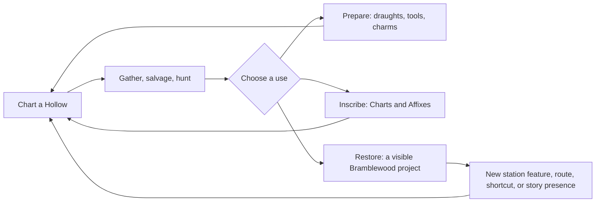

# Constructive Delving

## Decision in one page

Wayfinder should not add a second, Minecraft-scale survival/building game to
its dungeon crawler. It should make each Hollow return visibly and usefully
constructive: a player comes home with materials that can prepare the next
Chart, improve a chosen piece of kit, or mend a specific part of Bramblewood.
The **third destination** is the missing one. Materials that only become
consumables or stat sticks are loot; materials that also change the place the
player inhabits become a contribution.

The recommended loop is:



This is an adaptation of several proven strengths: Minecraft's short,
legible transformation chain and placeable utility; Valheim's resource → base
→ further-biome rhythm; Dragon Quest Builders 2's blueprint-led communal
restoration; and Monster Hunter's targeted “one more hunt for this piece”
preparation loop. It should be softened with Stardew Valley's clear recipe
discovery and resource recycling, while avoiding Path of Exile's high-variance
gear gambling.

This is a design recommendation, not a claim that the compared games are
identical. All external factual statements below link to the source that owns
the documentation. The Terraria wiki brands itself the *Official Terraria
Wiki*; Stardew's community wiki is hosted by ConcernedApe, but is still
community-maintained; the remaining sources are developer/publisher manuals or
official sites. [Terraria wiki](https://terraria.wiki.gg/) · [Stardew wiki
about page](https://stardewvalleywiki.com/Stardew_Valley_Wiki:About)

## What is already true in Wayfinder

Wayfinder already has a strong kernel rather than an empty crafting problem:

- Stackable materials live in a Satchel, while gear uses a separate spatial
  Pack; materials therefore do not compete directly with loot for slots.
  [Gather data](/Users/bbroeking/projects/gj26/wyrd/data/gather.gd) · [item
  data](/Users/bbroeking/projects/gj26/wyrd/data/items.gd)
- The Cottage Hearth, Quill's Still, Hod's Anvil, Ember Kiln, and Chart Table
  already separate recovery, temporary preparation, equipment/tool crafting,
  later tempering, and run authoring. [Crafting data](/Users/bbroeking/projects/gj26/wyrd/data/crafting.gd)
- The forge already turns ores into bars and bars into tools/gear; its recipes
  are Trade-gated and some crafted gear rolls affixes. [Crafting data](/Users/bbroeking/projects/gj26/wyrd/data/crafting.gd)
- Existing system planning correctly identifies weak feedback at stations,
  missing still-buff visibility, shallow long-term sinks, and the need to keep
  vendor convenience from bypassing gathering. [Crafting system plan](/Users/bbroeking/projects/gj26/docs/system-plans/system-crafting.md) · [economy system plan](/Users/bbroeking/projects/gj26/docs/system-plans/system-economy.md)

So the production question is not “add crafting.” It is: **make source,
transformation, destination, and visible consequence legible for every
meaningful material.**

## Comparative mechanism study

| Game | Documented mechanism | Why it feels constructive | Wayfinder reading |
|---|---|---|---|
| Minecraft | A first wood block becomes planks; planks make the crafting table that unlocks the full recipe set. The recipe book can search recipes and puts missing ingredients in red, while different resources demand different collection methods. [Minecraft: How to craft](https://www.minecraft.net/en-us/article/how-craft) | The first conversion is immediate, recursive, and changes what the player can do next. The table is both a crafted object and a world utility. | Borrow the **one-return transformation**: early ore/herb/wood should make a useful, visible thing on the same return, not wait behind a long material list. |
| Minecraft | Recipes can be discovered and added to recipe books as play unlocks; Minecraft later adjusted unlocks to make vital recipes easier for new players. [Minecraft snapshot 18w06a](https://www.minecraft.net/en-us/article/minecraft-snapshot-18w06a) · [Minecraft Java 1.19.4](https://www.minecraft.net/en-us/article/minecraft-java-edition-1-19-4) | Discovery supplies curiosity without making the player memorize a wiki. | Use encounter/first-pickup discovery for optional recipes, but give every progression-critical recipe directly and explain its next source. |
| Minecraft | Smithing Tables use an equipment item, materials, and a Smithing Template; templates define the permitted upgrade/customization and are consumed, but can be copied with a costly recipe. [Trails & Tales update](https://www.minecraft.net/en-us/article/trails---tales-update-now-available-bedrock) | A rare find has a clear, expressive use instead of being a generic stat token. | Adapt templates into **Waymark patterns** or **Charm motifs**: a discovered pattern grants a chosen, readable style/effect family, never a blind reroll. |
| Terraria | Available recipes depend on inventory and proximity to placed stations; stations can be combined in a player-made workshop, and the Guide shows an item’s uses and required stations. [Official Terraria Wiki: Crafting 101](https://terraria.wiki.gg/wiki/Guide%3ACrafting_101) | The workshop layout itself expresses knowledge and progress. | Adapt a compact “workshop neighborhood”: restored town fixtures visibly sit together and unlock small conveniences. Do not require freeform base optimization. |
| Terraria | Many key materials and stations are boss-gated; furnaces turn ore into bars, and different stations support tools, equipment, furniture, dyes, potions, and endgame materials. [Official Terraria Wiki: Crafting stations](https://terraria.wiki.gg/wiki/Crafting_stations) | A boss clear expands the material language, not only enemy health. | Boss trophies should unlock one **new material transformation or project tier** as well as a Chart/campaign beat. Avoid proliferating dozens of micro-stations. |
| Valheim | Its official site describes a loop of gathering materials, crafting weapons/armor/tools/ships, decorating hearths, farming, and brewing; bases have construction and tiered expansion. [Valheim official site](https://www.valheimgame.com/) | Base improvement is an authored record of expeditions, not a menu backdrop. | Borrow visible **tiered settlement growth** and the feeling that preparation creates safety. Keep it town-scale rather than a survival building simulator. |
| Valheim | The official FAQ says stations such as kilns, smelters, and windmills refine raw materials; each biome has resources, enemies, craftable/buildable items, and a boss, and boss progression leads toward the next biome. [Valheim FAQ](https://www.valheimgame.com/faq/) | Biome, resource, and tool/weapon gate reinforce one another. | Each Wayfinder Chapter should introduce only one new resource family or refinement, then put that output in at least two meaningful destinations. |
| Dragon Quest Builders 2 | Villager requests lead the player to restore settlements. Blueprints show a structure's material requirements, and villagers can help build once sufficient materials are available; furnishing combinations also give rooms recognizable uses. [Nintendo: Dragon Quest Builders 2](https://www.nintendo.com/en-gb/Games/Nintendo-Switch-games/DRAGON-QUEST-BUILDERS-2-1514364.html) | A material list becomes a shared, visible construction event, and the finished place changes how inhabitants behave. | Adapt the blueprint as a **Worksite contribution contract**: show the damaged place, required bundle, future silhouette, and Neighbor who will help finish it. Use authored sites and functions rather than universal block placement. |
| Stardew Valley | Crafting recipes consume stated inputs; ten are known initially and others come from skill levels, special orders, shops, or friendships. Known recipes are shown, unavailable ingredients are visibly marked, and advanced crafting information tracks completion. [Stardew Crafting](https://stardewvalleywiki.com/Crafting) | The player has clear goals, several gentle discovery paths, and a collection horizon. | Borrow source transparency and multiple discovery channels. A recipe should show “found in: Hollow / Neighbor / Trade / story” before it becomes a hidden grind. |
| Stardew Valley | Crafted machines convert inputs over time, often to higher-value outputs; the Recycling Machine turns fishing trash into useful resources and is unlocked by Fishing level. [Stardew Artisan Goods](https://www.stardewvalleywiki.com/Artisan_Goods) · [Recycling Machine](https://stardewvalleywiki.com/Recycling_Machine) | Even low-status finds can feed a future project, which makes gathering feel less wasteful. | Add a small, deterministic **salvage/refinement** route for unwanted Hollow finds. It must be a bonus path, not an idle timer wall. |
| Stardew Valley | Crafted seed starters can be planted and spread; its craft list includes utility, automation, décor, paths, lighting, storage, travel, and production equipment. [Stardew Crafting](https://stardewvalleywiki.com/Crafting) · [recipe list](https://stardewvalleywiki.com/Template:CraftingRecipes) | Many recipes alter daily life, space, or expression rather than only combat numbers. | At least half of new Wayfinder craft outputs should be **utility, restoration, cosmetic, or run-shaping**, not direct damage/defense. |
| Monster Hunter | Its official manual frames the Smithy around forging or upgrading equipment from acquired materials; Market inventory expands with hunter rank, and loadouts save item/equipment/layered-equipment configurations. [Sunbreak facilities manual](https://game.capcom.com/manual/Multi-Platform/en/xone/page/5/2) | A specific hunt produces materials for a specific next loadout, so repetition has an intelligible purpose. | Give every desired forged item a **source card** and a pin/wishlist. A player should know which Chart, creature, or gather node advances it. |
| Monster Hunter | Forging/upgrading uses materials and currency, weapons can follow an upgrade path, high-rank gear gains decoration slots, and rollback returns spent upgrade materials in the cited manual. [Sunbreak weapons & armor manual](https://game.capcom.com/manual/Multi-Platform/en/xone/page/9/1) · [decorations manual](https://game.capcom.com/manual/Multi-Platform/en/xone/page/9/4) | It supports planned builds while allowing safe course correction. | Adapt a limited, low-cost **respec/rollback** for deliberate upgrades and charm choices. Do not lock a cozy player into a permanent mistake. |
| Monster Hunter | Crafting can happen during a hunt; storage resources are available from a tent, and items can be set to auto-craft from the right gathered combination. [Monster Hunter Wilds starter guide](https://www.playstation.com/en-us/games/monster-hunter-wilds/monster-hunter-wilds-starters-guide/) | Field collection serves immediate survival rather than being deferred entirely to town. | Add only a narrow field-crafting lane: prepared recovery draughts, an emergency ward, or a one-use cache. Keep durable gear, Charts, and projects at town stations. |
| Path of Exile | The developer’s currency-system article describes currency items as stackable, scarce items with direct item-improvement uses; it argues that useful currency creates its own sink and explicitly rejects repair taxes. [Designing Path of Exile’s Currency System](https://www.pathofexile.com/forum/view-thread/55102) | A drop can be spent, saved, or traded; no resource is merely a number. | Borrow the **positive sink** principle: spend resources to create a desired next experience, not to cancel decay. Wayfinder is single-player/co-op first, so use far fewer currencies and no player-market dependence. |
| Path of Exile | The same source documents random outcomes such as adding, upgrading, rerolling, or randomizing item properties. [Designing Path of Exile’s Currency System](https://www.pathofexile.com/forum/view-thread/55102) | This supports a high-variance loot economy, but it makes an individual investment uncertain. | Reject this as the core progression path. Put randomness in optional Chart Affixes and drops, while player-crafted equipment/project results stay legible and dependable. |

## Cross-game answers to the design checklist

| Design concern | Reliable pattern | Wayfinder policy |
|---|---|---|
| Acquisition | Different sources should imply different actions: Minecraft distinguishes extraction methods; Valheim ties a biome’s resources to its progression; Monster Hunter ties target materials to repeatable hunts. [Minecraft: How to craft](https://www.minecraft.net/en-us/article/how-craft) · [Valheim FAQ](https://www.valheimgame.com/faq/) · [Sunbreak facilities manual](https://game.capcom.com/manual/Multi-Platform/en/xone/page/5/2) | Every material UI card names one primary source and one mercy source. Primary sources are distinct Hollow actions; mercy sources prevent a blocked recipe from becoming an indefinite farm. |
| Recipe discovery | Recipe books and visible unmet ingredients reduce memory burden; Stardew adds skill, social, order, and shop routes. [Minecraft: How to craft](https://www.minecraft.net/en-us/article/how-craft) · [Stardew Crafting](https://stardewvalleywiki.com/Crafting) | Start with foundations; unlock useful side recipes via first pickup, Neighbor lesson, Trade milestone, or clue. Do not make a main quest recipe an accidental experiment. |
| Station tiers | Terraria and Valheim let stations/refinement encode progression; too many stations produce menu and layout sprawl. [Terraria Crafting 101](https://terraria.wiki.gg/wiki/Guide%3ACrafting_101) · [Valheim FAQ](https://www.valheimgame.com/faq/) | Retain five named Wayfinder surfaces (Hearth, Still, Anvil/Kiln, Chart Table, Project Board). A station gains visually readable tiers instead of multiplying into specialized benches. |
| Spatial construction | Minecraft, Terraria, Valheim, and Stardew all make crafted things placeable, functional, or decorative; Dragon Quest Builders 2 makes blueprint requirements and community construction part of settlement restoration. [Minecraft: How to craft](https://www.minecraft.net/en-us/article/how-craft) · [Terraria Crafting stations](https://terraria.wiki.gg/wiki/Crafting_stations) · [Valheim official site](https://www.valheimgame.com/) · [Stardew Crafting](https://stardewvalleywiki.com/Crafting) · [Nintendo: Dragon Quest Builders 2](https://www.nintendo.com/en-gb/Games/Nintendo-Switch-games/DRAGON-QUEST-BUILDERS-2-1514364.html) | Use authored restoration sites with a choice of visible finish, banner, planting, or tool arrangement. Show the future silhouette and let a Neighbor help complete it. This delivers ownership without grid building, physics, housing rules, or destruction. |
| Transformation | Minecraft’s wood→planks→table, Terraria ore→bar, Valheim’s refining stations, and Stardew machines all create readable intermediate states. [Minecraft: How to craft](https://www.minecraft.net/en-us/article/how-craft) · [Terraria Crafting stations](https://terraria.wiki.gg/wiki/Crafting_stations) · [Valheim FAQ](https://www.valheimgame.com/faq/) · [Stardew Artisan Goods](https://www.stardewvalleywiki.com/Artisan_Goods) | Cap ordinary chains at two transformations: raw → refined → use. Longer chains belong only to one memorable legendary project. |
| Item sinks | PoE demonstrates the value of consumable utility, while Stardew’s recycling demonstrates that low-value matter can remain useful. [Path of Exile currency system](https://www.pathofexile.com/forum/view-thread/55102) · [Stardew Recycling Machine](https://stardewvalleywiki.com/Recycling_Machine) | Main sinks: Charts, draughts/field kits, chosen upgrades, restoration projects, cosmetics. Never use mandatory durability repair or loss of a key item as the sink. |
| Failure and repair | Monster Hunter makes equipment correction possible with rollback; PoE deliberately omits repair taxes. [Sunbreak weapons & armor manual](https://game.capcom.com/manual/Multi-Platform/en/xone/page/9/1) · [Path of Exile currency system](https://www.pathofexile.com/forum/view-thread/55102) | A failed delve costs time and optional consumables, not permanent gear degradation. Allow one reversible decision per build lane; reserve loss for opt-in high-risk Chart Affixes. |
| Quality and modifiers | Monster Hunter adds controlled slots/build choices; Minecraft templates add constrained customization; PoE offers high variance. [Sunbreak decorations manual](https://game.capcom.com/manual/Multi-Platform/en/xone/page/9/4) · [Minecraft Trails & Tales](https://www.minecraft.net/en-us/article/trails---tales-update-now-available-bedrock) · [Path of Exile currency system](https://www.pathofexile.com/forum/view-thread/55102) | Material grade determines **which family** of effect is available; player choice determines the effect. Avoid random rerolls of a hard-earned crafted item. |
| Progression gates | Valheim’s biome/boss ladder and Terraria’s boss/station gates make advance concrete. [Valheim FAQ](https://www.valheimgame.com/faq/) · [Terraria Crafting 101](https://terraria.wiki.gg/wiki/Guide%3ACrafting_101) | One Chapter gate should unlock an input, a recipe family, and a visible place change—never three unrelated grinds. |
| Inventory friction | Minecraft surfaces missing inputs; Terraria has added nearby-chest crafting; Monster Hunter stores materials and supports loadouts. [Minecraft: How to craft](https://www.minecraft.net/en-us/article/how-craft) · [Terraria Crafting stations](https://terraria.wiki.gg/wiki/Crafting_stations) · [Sunbreak facilities manual](https://game.capcom.com/manual/Multi-Platform/en/xone/page/5/2) | Keep materials in the Satchel with high stacks and direct station access. The Pack remains a tactical gear puzzle only. Give projects/recipes a “pull from Satchel” action and a pinned shopping list. |
| Expression | Valheim supports detailed building and decoration, Stardew offers placeable utility/decor, and Monster Hunter separates layered appearance from stats. [Valheim official site](https://www.valheimgame.com/) · [Stardew Crafting](https://stardewvalleywiki.com/Crafting) · [Sunbreak weapons & armor manual](https://game.capcom.com/manual/Multi-Platform/en/xone/page/9/1) | Expression comes from restoration finish, garden/lantern/banners, Charm motifs, and selected Chart style—not from statistically mandatory cosmetics. |
| Anti-grind | Monster Hunter supports targeted repeats and loadouts; Stardew provides multiple unlock channels; Valheim makes a boss unlock the next biome; all reduce “farm anything” ambiguity. [Sunbreak facilities manual](https://game.capcom.com/manual/Multi-Platform/en/xone/page/5/2) · [Stardew Crafting](https://stardewvalleywiki.com/Crafting) · [Valheim FAQ](https://www.valheimgame.com/faq/) | A pinned goal must state source, expected progress, alternate source, and a first-clear guarantee. One short run should always produce at least one meaningful advance toward a chosen goal. |

## The proposed Wayfinder resource architecture

### 1. Give every important material three destinations

Each family must have at least one use in each column. A material with only one
destination is a bottleneck; a material with no durable/world destination is
forgettable.

| Family | Delve acquisition | Prepare / improve | Inscribe / shape a run | Restore / express |
|---|---|---|---|---|
| Earthcraft | Ore seams, broken mechanisms, stone caches | bars, tools, gear frames, charms | mineral-leaning Ink or stable Binding | bridge braces, forge/kiln tier, path/waystone repairs |
| Wildcraft | herbs, roots, wood, fungus, garden salvage | draughts, tonics, cords, dyes | herb/fog/route Inks | cottage garden, hedgerow, healing well, lantern oil |
| Huntcraft | named creature parts, trophies, hides | gear motifs, field wards, specialty charm inputs | creature-focused Affix or Boss Chart component | lodge display, trail signs, creature codex reliefs |
| Wayfinding | clues, chart components, recovered marks | surveying conveniences | Chart Base, Waymark, Binding, Ink, Seal | Living Atlas, repaired routes, visible expedition record |
| Hollow salvage | damaged relics and excess drops | refinement into a common project reagent | modest stability material | restoration filler, décor, trade-ins |

The names above are mechanical categories, not new canon. Existing terms such
as Chart, Affix, Waymark, Binding, Ink, Trade, and Satchel remain the
ubiquitous language in [CONTEXT.md](/Users/bbroeking/projects/gj26/CONTEXT.md).

### 2. Make restoration the spatial-construction layer

Use **authored contribution sites**, not free placement. Each project has:

1. a physical, inspectable site in Town or at a Road return;
2. three visible states — damaged, working, and tended;
3. one short material bundle plus one Chapter/Neighbor condition;
4. a player-facing practical benefit; and
5. one small expressive choice with no power differential.

Examples: mend a collapsed trail bridge for a shortcut, rehang the Lantern
Walk for clearer source hints, replant Quill’s garden for one additional
Wildcraft recipe path, repair a tool rack for a loadout preset, or restore an
Atlas alcove for a chosen Chart preview/record. This preserves Wayfinder’s
cozy village scale and creates the “I made this place more capable” feeling
without promising Minecraft’s fully mutable world.

### 3. Use a simple refinement grammar

```
raw material → refined component → chosen output
               ↘ project reagent ↗
```

Ordinary outputs should cost one raw family plus one common connective
material; they should not demand six unrelated rare drops. The one exception
is a story/legendary project such as Wayweaver, where a longer chain is a
feature because each intermediate part can be displayed and named.

### 4. Put choice before randomness

For a crafted bow, charm, or restoration finish, the player chooses the lane
(for example, swift / steady / keen) and sees the outcome. A Chart can retain
the game’s existing affix uncertainty, because the uncertainty is itself part
of choosing a route. This division gives ARPG replayability without making
every craft feel like a lost wager.

## Borrow, adapt, reject

### Borrow directly

- Minecraft’s first-return, recursive transformation and recipe clarity.
- Terraria’s placed-workshop identity and item-use lookup.
- Valheim's visible settlement tiering and biome/resource/boss rhythm.
- Dragon Quest Builders 2's visible blueprints, finite contribution targets,
  and Neighbor-assisted completion beat.
- Stardew’s several gentle recipe-discovery routes, missing-ingredient
  readability, recycling, and strong utility/decor ratio.
- Monster Hunter’s wishlists, source-targeted upgrades, loadouts, and safe
  build correction.
- Path of Exile’s principle that a resource sink should create a desired action
  rather than collect a punishment tax.

### Adapt carefully

- **Station adjacency:** present it as an authored town cluster and a
  restoration payoff, not an optimization puzzle with dozens of benches.
- **Timed processing:** use a short, skippable visual beat or return-to-town
  presentation. Never make a real-time queue the primary gate to a Chart.
- **Templates/modifiers:** use discovered motif families and fixed previews,
  with a limited respec, rather than unbounded reroll currency.
- **Field crafting:** restrict it to small survival decisions, preserving Town
  as the emotional preparation space.
- **Build expression:** use curated site choices, rotating decorations, and
  path/garden/lantern states; do not expand scope into structural physics,
  raids, support rules, or universal voxel placement.

### Reject for this game

- Mandatory durability and repair bills. They turn gathering into maintenance
  rather than care, and even Path of Exile’s currency-system rationale calls
  out avoiding repair as a negative sink. [Path of Exile currency system](https://www.pathofexile.com/forum/view-thread/55102)
- Randomly rerolling an invested crafted item as the main route to power.
- Opaque rare-drop recipes, hidden extraction breakpoints, or a recipe book
  that conceals the player’s next actionable source.
- Hundreds of station types, raw-material inventory Tetris, and player-market
  price dependence.
- Large construction systems that compete with combat, Chart authorship, and
  the intimate Bramblewood premise.

## Anti-grind operating rules

These are requirements for the system, not tuning suggestions:

1. **One selected goal, one visible forecast.** Pin a recipe/project and show
   its primary source, alternate source, existing count, and a compact “next
   useful action” prompt.
2. **First-clear certainty.** A first completion of an appropriate Hollow
   grants a guaranteed project/recipe component; repeat runs supply flexible
   improvement material, not a chance to begin progress.
3. **Pity without a visible slot machine.** After a small number of eligible
   runs without the pinned uncommon material, replace one generic reward with
   that material. Communicate “the trail is getting warm,” not a percentage.
4. **No material-only Pack pressure.** Harvested materials go to the Satchel;
   gear and field decisions remain the Pack’s job.
5. **Two source lanes, not universal conversion.** A material has a primary
   skillful/targeted source and a slower mercy source. Do not allow common
   materials to infinitely transmute into every boss/Chapter material.
6. **Every expense buys agency.** Chart resources buy a chosen run condition;
   preparation buys a tactical plan; project materials buy a visible world
   change. Never charge a resource merely to keep previously earned power.
7. **Stop rules.** A project should accept a finite bundle and stay complete.
   Cosmetics can be repeatable, but no player-facing town system should demand
   infinite upkeep.

## Production-sized first slice

Do not build the full architecture at once. Validate the loop with one
restoration project connected to current content.

| Slice | Deliverable | Acceptance evidence |
|---|---|---|
| Source clarity | Pin one forge item, one Still recipe, and one Chart component; each names a source and shows Satchel count. | A new player can answer “what do I do next?” without external documentation. |
| Visible project | Add one damaged Town/Road site with a small Earthcraft + Wildcraft bundle and a Chapter condition. | The site changes mesh/VFX/dialogue and unlocks one real convenience. |
| Meaningful choice | Let the player choose one visual finish or one non-power presentation at completion. | Two saves show visibly different, equally functional results. |
| Salvage | Turn one existing low-value Hollow drop into a project reagent through a clear station action. | An unwanted drop has a legible destination and no new random roll. |
| Safety | Add first-clear guarantee, pinned-goal mercy sourcing, and Satchel-only material handling. | A targeted run always advances a chosen goal; no materials fill the Pack. |
| Test / playtest | Exercise save persistence, no-loss spending, host authority if co-op applies, gated-preview behavior, and a five-player comprehension playtest. | All automated contracts pass; four of five fresh players identify source, cost, and payoff unaided. |

The existing station-feedback and economy safety work should precede or travel
with this slice: active Still buffs must be visible, a successful station craft
must react in-world, trophies must not be vendor fodder, and vendor convenience
must not erase gathering. [Crafting system plan](/Users/bbroeking/projects/gj26/docs/system-plans/system-crafting.md) · [economy system plan](/Users/bbroeking/projects/gj26/docs/system-plans/system-economy.md)

## Questions to settle before content production

1. Is the restoration payoff primarily **convenience** (shortcut, loadout,
   source hints), **story presence** (Neighbor and place change), or **new
   crafting capability**? The first project should have one primary payoff,
   not all three at maximum strength.
2. Which existing low-value Hollow results are safe to designate as salvage?
   This requires an economy pass so salvage cannot bypass Chapter or boss
   materials.
3. Should project choices be purely visual, or should they select between two
   equal-but-different services? The latter is stronger expression but requires
   more balance and save-state support.
4. Which item source gets the first wishlist? Implement it before expanding
   recipe count; visibility prevents a larger catalog from becoming a larger
   grind.

## Source register

- Mojang, [How to craft](https://www.minecraft.net/en-us/article/how-craft),
  2023.
- Mojang, [Minecraft Snapshot 18w06a](https://www.minecraft.net/en-us/article/minecraft-snapshot-18w06a),
  2018; [Minecraft Java Edition 1.19.4](https://www.minecraft.net/en-us/article/minecraft-java-edition-1-19-4),
  2023; [Trails & Tales update](https://www.minecraft.net/en-us/article/trails---tales-update-now-available-bedrock),
  2023.
- Re-Logic / Official Terraria Wiki, [Crafting 101](https://terraria.wiki.gg/wiki/Guide%3ACrafting_101)
  and [Crafting stations](https://terraria.wiki.gg/wiki/Crafting_stations),
  accessed 2026-09-02.
- Iron Gate, [Valheim official site](https://www.valheimgame.com/) and
  [Valheim FAQ](https://www.valheimgame.com/faq/), accessed 2026-09-02.
- Nintendo, [Dragon Quest Builders 2](https://www.nintendo.com/en-gb/Games/Nintendo-Switch-games/DRAGON-QUEST-BUILDERS-2-1514364.html),
  accessed 2026-09-02.
- ConcernedApe-hosted community wiki, [Crafting](https://stardewvalleywiki.com/Crafting),
  [Artisan Goods](https://www.stardewvalleywiki.com/Artisan_Goods), and
  [Recycling Machine](https://stardewvalleywiki.com/Recycling_Machine),
  accessed 2026-09-02.
- Capcom, [Monster Hunter Rise: Sunbreak — facilities](https://game.capcom.com/manual/Multi-Platform/en/xone/page/5/2),
  [weapons & armor](https://game.capcom.com/manual/Multi-Platform/en/xone/page/9/1),
  and [talismans & decorations](https://game.capcom.com/manual/Multi-Platform/en/xone/page/9/4),
  accessed 2026-09-02; PlayStation, [Monster Hunter Wilds starter guide](https://www.playstation.com/en-us/games/monster-hunter-wilds/monster-hunter-wilds-starters-guide/),
  accessed 2026-09-02.
- Grinding Gear Games, [Designing Path of Exile’s Currency System](https://www.pathofexile.com/forum/view-thread/55102),
  accessed 2026-09-02.
