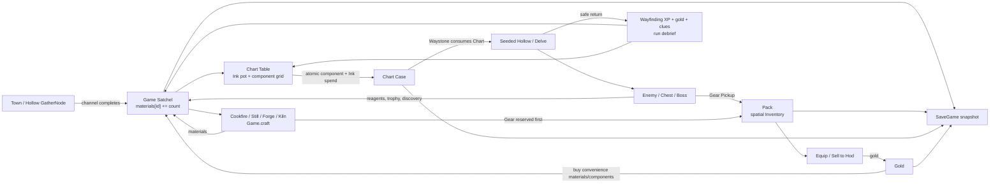

# Wayfinder resource and crafting system audit

Audited 2026-09-02 against `codex/wayfinder-unified`. This is an implementation
audit, not a design intent document. A system is called **end-to-end** only when
its authored data, a runtime mutation path, a player-facing surface, and a
testable outcome all exist.

## Executive assessment

Wayfinder already has the bones of a credible constructive dungeon loop. It is
not merely a collection of resource data:

1. A player can channel on a physical GatherNode, receive a stackable material
   in the Satchel and Trade XP, then use that material in an Ink pot or a
   physical crafting station.
2. Crafted materials return to the Satchel; crafted Gear is reserved and placed
   in the spatial Pack; dropped Gear appears as a collectible world Pickup.
3. A Chart Table resolves a physical component/Ink arrangement, performs one
   atomic spend, creates a seeded Chart, and the Waystone consumes that Chart
   to construct a Hollow.
4. Kills, chests, boss trophies, authored campaign rewards, and completed
   Delves feed materials, Gear, gold, discoveries, and progression back into
   the next preparation cycle.
5. The durable state survives save/load with atomic write + backup and
   migration/recovery handling.

The primary production risk is **uneven completion**, not missing foundations.
Early and midgame resource loops are playable. The late-game resource ladder
has authored data and several bespoke runtime paths, but two normal station
surfaces are deliberately absent, the gold economy contains unfinished sinks,
and balancing/telemetry have not yet converted the many correct gates into a
proven player economy.

## System map and ownership

| Area | Authoritative data | Runtime owner | Player surface | Status |
|---|---|---|---|---|
| Stackables / Satchel | `wyrd/data/gather.gd:4-6` | `Game.materials`, `add_material`, `spend_materials` in `wyrd/scripts/game.gd:9972-10006` | Chart Table, station panels, Vendor, HUD/Pack | End-to-end |
| Gear / Pack | `wyrd/data/items.gd`; footprint on item records | `Inventory` in `wyrd/scripts/inventory.gd:1-120`; `Equipment` | Inventory/Pack and Loadout panels | End-to-end |
| Gathering | `GatherData.NODE_KINDS`, ore/herb tier tables in `wyrd/data/gather.gd` | `GatherNode` channel and harvest in `wyrd/scripts/gather_node.gd:212-334` | Town and Hollow world interactables | End-to-end |
| Cooking, brewing, smithing | station and recipe catalogues in `wyrd/data/crafting.gd:10-66` | `Game.craft` in `wyrd/scripts/game.gd:10371-10442` | `CraftStation`, `CraftPanel` | End-to-end for listed station recipes |
| Ink mixing | `GatherData.INK_RECIPES` | `CraftingBench.pot_add/pot_try` (`wyrd/scripts/ui/crafting_bench.gd:918-990`) | Chart Table's dedicated Mix Ink workspace | End-to-end |
| Chart assembly | `ChartsData.preview_table` / `materialize_chart` at `wyrd/data/charts.gd:1753,2819` | `Game.try_inscribe_chart` at `wyrd/scripts/game.gd:11887` | `ChartTableView` | End-to-end |
| Drops / chests | `wyrd/data/drops.gd:3-149` | `Combatant._spawn_drops` at `wyrd/scripts/combatant.gd:1304-1364`; `Chest.interact` at `wyrd/scripts/chest.gd:52-68` | Physical ItemPickups | End-to-end for Gear; reagent discovery is offline-only |
| Gold / merchant | `wyrd/data/economy.gd:4-67` | `Game.sell_item`, `Game.buy_ware` at `wyrd/scripts/game.gd:10329-10368` | Hod's `VendorPanel` | End-to-end for sale and material purchase |
| Delve settlement | Chart reward definitions / campaign data | `Game.return_to_town` at `wyrd/scripts/game.gd:12163-12254` | Far Waystone and Town debrief | End-to-end |
| Progression / unlocks | `wyrd/data/progression.gd` | `Game.award_xp` at `wyrd/scripts/game.gd:9758` | HUD, Trade/skill/station gates | End-to-end, with some passive placeholder unlocks |
| Persistence | versioned save schema | `SaveGame` at `wyrd/scripts/save_game.gd:42-155,253-393` | autosave / Continue | End-to-end |

## Actual data flow



Important boundaries:

- **Satchel is not the Pack.** `Game.materials` is an unlimited keyed stack
  store; the Pack is a 5-column Tetris grid for Gear only. This is explicit in
  `wyrd/data/gather.gd:4-6` and `wyrd/scripts/inventory.gd:1-18`.
- **UI does not own transaction rules.** `Game.craft` validates station,
  restoration, Trade level, affordability, and Pack capacity before spend.
  Chart previews are pure and Chart commits require a live fingerprint.
- **Campaign story items are protected resources.** Seals, clues, and Root
  Runes are prevented from becoming generic potion ingredients or random loot;
  boss Chart escrow is handled in the Game/Campaign boundary.

## What is genuinely playable, end to end

### Gathering and support Trades

`GatherNode` starts a cancellable channel, gates ore by Earthcraft and herbs by
Wildcraft, awards a material plus XP on completion, then depletes or respawns
depending on the node (`wyrd/scripts/gather_node.gd:212-334`). Tools and Trade
perks influence channel time/yield. Town owns renewable patches; the layout
loader instantiates the same system in Hollows. Rootroad sources inherit the
same logic through `RootroadGatherNode`.

The resource ladders are substantive: standard ore/herb tiers, rootroad
Wildgold/Wellmoss/Wellwater/Embersage, Chart components, story Seals, inks,
consumables, and enchant reagents all live in the same material authority.
`GatherData.raw_material_trade_requirements` and `ink_trade_requirements`
(`wyrd/data/gather.gd:465-521`) provide a useful pure prerequisite analysis
seam for future UI and content validation.

### Crafting and consumption

The station catalogue is broad: cookfire healing draughts, Quill's buff
draughts, Hod's ore/bar/tool/gear ladder, and Ember Kiln Alloy
(`wyrd/data/crafting.gd:10-63`). Recipes carry exact inputs, output type, XP,
and Trade gate. `Game.craft` spends only after it has established that a gear
output fits in the Pack; material outputs re-enter the Satchel. Crafting then
awards the relevant Trade XP, applies constrained perks, emits a station
signal, notifies the player, and saves.

The player can use health and timed-buff consumables in the live game; buff
definitions specify real stat modifications and durations in
`wyrd/data/crafting.gd:365-391`.

### Chartmaking is the strongest resource loop

This is Wayfinder's differentiated constructive mechanic:

- The 3×3 grid has typed cells for Waymarks, Bindings, Base, Relics and Seal;
  the Ink rail has capacity and compatibility rules (`ChartTableView` builds
  these real controls at `wyrd/scripts/ui/chart_table_view.gd:100-214`).
- The Satchel source list can stage supplies without spending; Ink mixing has
  a separate pot workspace rather than a hidden shortcut.
- `ChartsData.preview_table` resolves recipe identity, requirements, gates,
  costs, Affix odds, and a commit fingerprint without mutation.
- `Game.try_inscribe_chart` rejects stale, incomplete, unaffordable, full-case,
  and invalid-seed commits before spending. It materializes a deterministic
  Chart before consuming the supplies, records discovery XP once, and stores
  the Chart in the case.
- The Waystone removes the Chart from the case at entry; the active Chart feeds
  seed, scope, layer, Affixes, campaign contract, and reward configuration to
  the World builder (`Game.enter_dungeon`, `Game.run_cfg`).

This produces a real material pressure: gathering and/or buying supports
recipes; inks change risk/reward without changing the underlying Chart
identity; component arrangements choose the road; safe return creates more
material, knowledge, gold, and chapter access.

### Drops, loot, and rewards

Enemy death awards Huntcraft XP, rolls Gear into physical world pickups, then
awards reagent/discovery loot where eligible. Chest opening rolls twice and
uses the same Pickup pipe. `ItemPickup.try_take` first looks for Pack capacity;
there is no silent destruction of a gear drop when the Pack is full.

On successful return, `Game.return_to_town` grants completion XP, gold,
campaign-clue progress, an affix/return debrief, and first-return supplies
where appropriate. Abandoning pays no completion reward and triggers the
campaign attempt refund path. Multi-layer Charts offer a visible Far Waystone
return-versus-deepen choice with an Omen (`wyrd/scripts/exit_waystone.gd:108-134`).

### Gold, Gear, and persistence

Hod converts sellable Pack Gear to gold; his shelf sells selected low/deep
materials and inks behind Wayfinding gates. The documented intent is a
convenience tax, not a replacement for exploration (`wyrd/data/economy.gd:4-7`).
Gear has random-affix/drop tiers, explicit spatial footprints, equipment
slots, enchant slots, and Pack growth at Wayfinding milestones.

`SaveGame` snapshots materials, Charts, gold, Trades, inventory item positions,
equipment, campaign/escrow state, discoveries, journal data, and settings.
It writes via tmp + rename and retains a `.bak`; corrupt-primary recovery and
unresumable campaign escrow reconciliation are implemented.

## Evidence from executable checks

On 2026-09-02 I ran these targeted Godot 4.6.2 checks with `WYRD_NO_SAVE=1`:

```text
test_wyrd_loop.gd                 427 passed, 0 failed
test_wyrd_transitions.gd          passed
test_inventory.gd                 passed
test_drops.gd                     passed
test_economy.gd                   passed
test_save_roundtrip.gd            120 passed, 0 failed
test_chart_table_ui.gd            passed
test_ui_transaction_contract.gd   passed
```

The process emitted known Godot shutdown ObjectDB/resource-leak diagnostics in
some scene/UI suites. Those warnings do not invalidate the assertions, but they
are release-quality debt and should become a tracked stability task.

Broader coverage exists in `test_wyrd_transitions.gd`, `test_wyrd_loop.gd`,
`test_items.gd`, `test_enchants.gd`, `test_fire_in_the_bough_*`,
`test_pale_oath_*`, `test_root_below_*`, `test_wayweaver_*`, and UI contract
suites. The canonical project gate remains the 23-entrypoint shell script.

## Gaps and dead ends

These are evidence-based omissions, not inferred wishlist items.

1. **Two authored recipes are unreachable through the normal station UI.**
   `wellmoss_salve` and `wellwater_philter` are valid recipes but are kept in
   `CraftingData.ROOTROAD_STILL_RECIPES` rather than the Still's visible recipe
   list (`wyrd/data/crafting.gd:59-63`). Repository search finds their data and
   content tests, but no runtime station call site. Either ship a rootroad
   station/catalogue branch or remove/relocate these recipes until playable.

2. **Economy data promises mechanics the live product skips.**
   `CHART_TIER_FEE` is defined (`wyrd/data/economy.gd:39-45`) but has no live
   `Game.enter_dungeon` consumer. Hod's `repair_all` shelf record is explicitly
   omitted by `VendorPanel` because no durability system exists
   (`wyrd/scripts/ui/vendor_panel.gd:233-234`). These are false affordances in
   design data, even though the panel does not expose repair.

3. **The gold loop is narrow and unproven at production scale.** Gear sales,
   completion gold, component purchases, and material purchases work; there is
   no durable repair sink, reroll/salvage loop, tax/entry fee, or robust
   late-game vendor catalogue. No simulation or telemetry validates time-to-
   Chart, gold accumulation, purchase rate, or resource scarcity across the
   chapter ladder.

4. **Drops are Gear-forward; most raw progression resources are authored
   placement/reward gates.** This is appropriate for determinism, but it means
   the resource economy depends heavily on layout spawn guarantees. There is no
   automated all-seed, all-Chapter audit that proves each required non-buyable
   input is available before the recipe/gate that demands it.

5. **Enchant reagent and discovery rewards are intentionally disabled in
   active co-op.** `Combatant._award_enchant_loot` returns early under NetGame
   (`wyrd/scripts/combatant.gd:1343-1358`). The current product is single-
   player, so this is not a release blocker, but historical co-op must not be
   marketed as supporting the same resource economy.

6. **Pack scarcity is mechanically real but lacks recovery UX.** Items refuse
   to enter a full Pack and crafting correctly refuses to spend for a gear
   output that cannot fit. The audit did not find a player-facing drop queue,
   temporary overflow chest, send-to-stash action, or clear notification loop
   that protects a valuable boss drop beyond remaining in the world scene.

7. **Late-game recipes and Mastery have multiple bespoke paths.** The Wayweaver
   production chain uses `wayweaver_mastery.gd`, dedicated stations, and
   campaign validation rather than the ordinary `CraftingData` station
   catalogue. That is thematically defensible, but two mutation frameworks now
   coexist. The rules need a unified inventory/transaction interface before
   adding another endgame craft.

8. **Testing is strong on correctness, weaker on economy experience.** The
   current tests prove atomicity, gates, persistence, and UI contracts. They
   do not prove: a fresh player can understand resource sources; a full chapter
   can be funded without grinding; drop/affix distribution feels good; or that
   every displayed resource icon/name is legible in a real play session.

## Technical debt that matters to production

- `game.gd` is a 12k-line God object that owns durable state, transactions,
  campaign settlement, Web smoke automation, and many presentation adapters.
  It is the correct current transaction boundary but has become expensive to
  change safely. Extract resource transactions and run settlement into small
  services without changing public Game methods first.
- Data includes comments for intentionally deferred features (`repair_all`,
  entry fees, master-tool foundations). Production-facing data should not
  advertise unavailable mechanics.
- A functional Rootroad Still design is split from the standard station
  catalogue. Keep one station capability registry and filter it by restoration
  / Trade gate instead of hiding valid recipes in a secondary constant.
- Satchel materials are arbitrary string keys. Runtime mutations do not appear
  to reject unknown material IDs centrally. Add debug-time validation and a
  content audit that all recipes/rewards/icons reference known IDs.
- The save/load path has exemplary recovery coverage, but the game intentionally
  does not persist active runs. That must be prominent in UX and platform QA:
  player progress is preserved, but a closed-in-progress Delve is torn/refunded
  under controlled campaign rules rather than resumed.
- Resource leak warnings at test shutdown obscure real memory regressions.

## Prioritized implementation backlog

### P0 — make the existing resource contract truthful

1. **Decide and implement the Rootroad Still.** Add the level-18/19 recipes to
   the restored Still (or a new in-world station) with the existing transaction
   owner; show exact source/gate/benefit in its panel.
   - Acceptance: a clean level-18/19 state can gather Wellmoss/Wellwater,
     open the correct station, craft each recipe exactly once per cost, consume
     the resulting item, save/load it, and see no recipe before its gate.

2. **Remove or implement dormant gold mechanics.** Either integrate tier entry
   fees at the Waystone and an actual durability/repair loop, or delete the
   unused fee and repair records until a later milestone.
   - Acceptance: every `EconomyData` public ware/fee is either visible and
     transactionally enforced or absent from authored production data; no UI
     hides a supposedly purchasable ware as a special case.

3. **Ship a full-Pack reward safety policy.** Choose one: persistent overflow
   chest, return-to-town mail, explicit salvage, or guaranteed valuable-drop
   placement near the waystone. Do not silently expand capacity.
   - Acceptance: fill the Pack, kill/open every reward source including boss
     reward, leave/reload/return, and prove the item remains recoverable once
     and cannot duplicate.

### P1 — prove the economy rather than just its transactions

4. **Build a deterministic resource-route validator.** For every authored
   Chart/Chapter, calculate prerequisites from the pure gather/ink/recipe data,
   then prove a source path exists at or before the gated Trade level.
   - Acceptance: CI report lists each recipe input's renewable source, minimum
     Trades, biome/Chapter, buyability, and whether it is story-protected;
     fails on unknown IDs, cycles, or unsourced required inputs.

5. **Add economy telemetry and a seeded progression simulator.** Log gathering
   time, spends, shortages, purchases, returns, drop rarity, completed/abandoned
   Charts, and Pack-full events locally in development builds.
   - Acceptance: a scripted new-game-to-each-chapter path emits a CSV/JSON
     ledger and defines targets for minutes per Chart, purchase share, shortage
     rate, and resource stock ranges.

6. **Tighten gold faucets/sinks after measurement.** Tune completion gold,
   sale values, component prices, and late-game convenience purchase based on
   the simulator and playtests, rather than raw price intuition.
   - Acceptance: no buy→craft→sell arbitrage; core Chart ingredients remain
     gather-preferred; a player can recover from a bad spend without a forced
     grind longer than the intended loop length.

### P2 — simplify and harden the system for ongoing content

7. **Extract a `ResourceLedger` / transaction service from `Game`.** Preserve
   existing Game APIs as delegators initially; centralize known-ID validation,
   spend/add atomicity, and resource event emission.
   - Acceptance: crafting, Chart inscription, vendor purchase, drops, trophy,
     and mastery spend all produce one normalized transaction record; existing
     23 checkpoint entrypoints stay green.

8. **Create a content-completeness manifest.** One declarative table should
   cross-check materials, icons, gather source, recipes, station availability,
   drops, and localization/voice keys.
   - Acceptance: a headless test rejects a new material without display data,
     icon fallback policy, source, or valid consumer where required.

9. **Add economy UX research tests.** Use short external playtests focused on
   ‘Where do I get this?’ and ‘What should I make next?’ instead of only
   correctness automation.
   - Acceptance: five fresh players reach and explain the first
     gather→ink→Chart→return loop unaided; telemetry identifies the first
     unclear gate and drives an iterated tutorial/panel change.

## Recommended production sequence

Do P0 first, then run the P1 validator before tuning any prices. The game
already has enough mechanical breadth; adding more resource types now would
increase the surface area faster than player comprehension. The production
target should be a smaller number of materials with clear sources, visible
uses, satisfying conversion steps, protected valuable rewards, and measured
shortage/recovery behavior.
