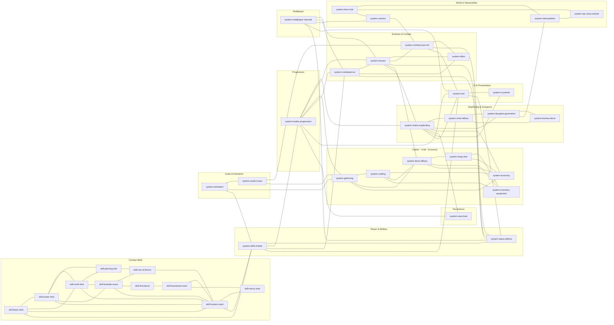

# Wayfinder System Map

A dependency / relationship overview of the plan notes. Nodes are grouped into
domain subgraphs; edges are the `links` declared between notes. The full link
set is dense (~220 undirected edges); this graph keeps **all intra-domain edges
plus the high-signal cross-domain spine** so the structure stays readable. For
the exhaustive per-note link lists, open each note.

**Hubs** (highest connectivity, the load-bearing systems):
`system-combat-juice-vfx`, `system-trades-progression`, `system-bosses`,
`system-charts-wayfinding`, `system-skills-hotbar`, `system-hud`,
`system-combatant-ai`, `system-status-effects`.

## How to read it

- **Combat Skills** form a tight internal mesh (synergy chains: Mark amplifies
  Power/Multi/Rain; Snare links the AoE family) and hang off
  `system-skills-hotbar`, which in turn is the bridge into **Progression**.
- **`system-trades-progression`** is the central spine: it touches the hotbar,
  charts, bosses, gathering, HUD, and save — the Wayfinding ladder is what ties
  the cozy-skilling loop to the combat loop.
- **`system-charts-wayfinding`** is the signature hub of the dungeon side,
  fanning out to affixes, generation, biomes, economy, and UI.
- **`system-combat-juice-vfx`** and **`system-hud`** are presentation hubs that
  almost every gameplay system feeds into — they are why a polish pass there
  (sparks, damage numbers, level-up banner, buff chips) lifts many notes at once.
- **`system-multiplayer-netcode`** reaches across into bosses, AI, camera, HUD,
  and status — the Phase C work is correctness glue that spans domains rather
  than a self-contained feature.

## A note on `system-player-controller`

Seven notes link to `[[system-player-controller]]`, but **no such note exists**
in the vault yet (it is the only dangling target — see the bottom of
[index.md](index.md)). It is omitted from the graph above. If authored, it would
sit in the Player & Abilities cluster as a hub between the hotbar, animation,
camera, and netcode.
